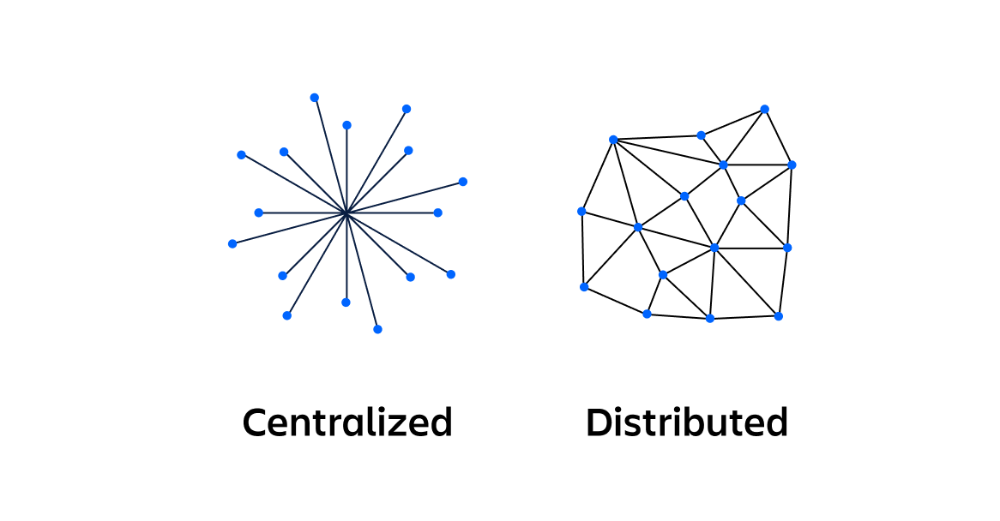

# Что такое Распределенная Система?

У термина **"Распределенные системы"**  несколько определений. 

В курсе разделяют распределенные **компьютерные** системы и распределенные **программные** системы.

***Распределенная компьютерная система*** - совокупность связанных сетью независимых компьютеров, которая представляется пользователю единым компьютером.\
***Распределенная программная система*** – совокупность компонентов, взаимодействующих посредством обмена сообщениями.

Сама ***распределенная система*** — это набор компьютерных программ, использующих вычислительные ресурсы нескольких отдельных вычислительных узлов для достижения одной общей цели. Её также называют _распределенными вычислениями_ или _распределенной базой данных_. \
Распределенная система основывается на отдельных узлах, которые обмениваются данными и выполняют синхронизацию в общей сети. Обычно узлы представляют собой отдельные физические аппаратные устройства, но это могут быть и отдельные программные процессы или другие рекурсивные инкапсулированные системы. Распределенные системы направлены на устранение узких мест или единых точек отказа в системе.

Классическими примерами РС могут выступать сети рабочих станций, кластеры ЭВМ, многопользовательские сервисы (как каких-то больших и важных жизненных компонентов типа банковских операций, так и игрулек-мультиплееров) и многие другие, где создание центрального узла критически неудобно или вовсе невозможно.

# Особенности РС

Что же отличает распределённые системы от привычных нам централизованных?

**Основное различие** между централизованными и распределенными системами заключается **в модели взаимодействия между узлами системы**. В централизованной вычислительной системе все вычисления выполняются на одном компьютере и в одном месте. Состояние централизованной системы хранится в центральном узле, к которому индивидуально обращаются клиенты. Поскольку все узлы централизованной системы обращаются к центральному узлу, это может привести к перегрузке сети и замедлить ее работу. **Централизованная система имеет единую точку отказа**, тогда как в распределенной системе такой точки нет.

**Развитию распределенных систем** способствовало несколько факторов. В частности, **широкое развитие сетевых технологией** и методов передачи сообщений, а также **возможность параллельной обработки множества задач** позволили разделять единый поток запросов по системе и выполнять работы, как мимнимум, быстрее. Кроме этого, развитие **микросервисной архитектуры приложений** (не путать с микросервисной архитектурой системы: первое - программное разделение проекта, второе - обеспечивающая это аппаратная реализация) позволило часть вычислений проводить ближе к пользователю (**edge computing**). Не обошлось и без юридического аспекта: **возможность локализации данных** при наличии полного доступа к сервису позволяют обеспечивать хранение и обработку данных в соответствующей юрисдикции. 

## Ключевые плюсы и минусы РС

 + ***Плюс: Надёжность системы*** и ***независимые отказы*** \
   Отсутствие единых точек отказа и узких мест повышает общую надёжность системы, кроме этого избыточность узлов[(1)](<01. Введение в предмет.md#Дополнения##1. Типы РС>) позволяет системе продолжать работу при отключении какого-либо из них, возможно, с меньшей производительностью;
 
 + ***Плюс: Производительность системы*** \
   Повышенная производительность достигается за счёт простого масштабирования системы _по горизонтали_ - увеличения количества подключённых в систему узлов - и _по вертикали_ - повышения производительности отдельных узлов / замены их на более продвинутые;

+ ***Минус: Нарастаемая сложность обслуживания*** \
  С ростом подключаемых узлов, которые, в общем случае, _гетерогенны_ (различны в плане аппаратного и программного обеспечения и способов взаимодействия) техническое обслуживание системы затрудняется. По мере усложнения системы у команды могут возникать трудности с эффективным управлением, организацией и совершенствованием системы. В частности, может возникнуть проблема с пониманием того, как связаны между собой различные компоненты и кто является владельцем конкретного программного компонента. Бывает трудно понять, как внести изменения в компоненты, чтобы максимально повысить работоспособность и при этом избежать негативного воздействия на зависимые компоненты и клиентов;

 + ***Минус: Отсутствие единой политики безопасности*** \
   Из-за гетерогенности системы реализовать единый способ защиты данных становится достаточно трудной задачей. Кроме того, распределение данных по системе и их перемещение в сети делают системы уязвимыми ко внешним атакам;

 + ***Минус: Сложности с консистентностью данных*** \
   Распределенная система требует постоянного согласования данных на узлах, что при отсутствии единого централизатора данных (иначе это не была бы распределенная система) затруднительно. Существует множество методов консистентности данных, о которых мы будем говорить позже, пока лишь отметим, что этот параметр критически важен для работы системы

# Распределенные Операционные Системы

Отдельной строкой в мире распределенных систем можно выделить распределенные операционные системы.\
***Распределенная операционная система*** – это ОС, которая создает иллюзию единой системы, управляя всеми ресурсами распределенной сети, как если бы это был один большой компьютер. Она абстрагирует детали распределения от пользователя и приложений, управляя всеми элементами системы на разных узлах самостоятельно, в отличие от множества локальных ОС в стандартном понимании распределённой системы. 

Распределенная ОС выступает в роли менеджера ресурсов системы, отдельно обрабатывая интерфейс пользователя и программ, работая единым управляющим распределенным звеном. Многие современные распределенные системы не имеют распределённой ОС под своим капотом, а лишь поверх локальных ОС предоставляют протоколы для их взаимодействия и используют какое-то промежуточное ПО для этого.

# Краткая история развития Распределенных Операционных Систем

$Ответ\ спонсирован\ ChatGPT\ (хрень,\ вроде,\ не\ написал)$

### 1940-е - 1950-е: Зарождение и Монолитные Системы

 + ***Ранние вычислительные машины:*** Первые компьютеры были громоздкими, дорогими и работали на основе монолитных операционных систем. Каждая задача выполнялась на одном процессоре, и не было никакой идеи о распределении.
 + ***Отсутствие концепции распределения:*** В этот период операционные системы были больше похожи на наборы утилит для управления аппаратным обеспечением. Многопользовательских или распределенных возможностей не было.

### 1960-е: Пакетная обработка и Первые Шаги к Многозадачности

 + ***Мейнфреймы и пакетная обработка:*** Основной формой вычислений была пакетная обработка, когда задания выполнялись одно за другим. Операционные системы управляли очередями заданий.
 + ***Начало развития многозадачности:*** Появляются первые системы с ограниченной многозадачностью, позволяющие нескольким программам выполняться "одновременно" на одном процессоре. Это был шаг к более сложным ОС, но всё ещё не было распределения.
 + ***Влияние ARPANET:*** Появление сети `ARPANET` (предшественника интернета) в конце 1960-х годов стало важным стимулом для развития распределенных систем, хотя сами ОС оставались в основном монолитными.

### 1970-е: Появление Сетей и Локальных Вычислений

 + ***Развитие компьютерных сетей:*** Появление локальных сетей (`LAN`) и стандартов передачи данных (например, `Ethernet`) сделало возможным взаимодействие компьютеров между собой.
 + ***Первые концепции распределенных вычислений:*** Начали появляться идеи о том, что можно использовать несколько компьютеров для решения одной задачи, но полноценные распределенные ОС ещё не были распространены.
 + ***Протоколы сетевого взаимодействия:*** Были разработаны протоколы для обмена данными между компьютерами в сети, что стало фундаментом для будущих распределенных систем.
 + ***Миникомпьютеры:*** Появление более доступных миникомпьютеров позволило экспериментировать с распределенными приложениями и концепциями.

### 1980-е: Распределенные Файловые Системы и Первые Распределенные ОС

 + ***Распределенные файловые системы (NFS, AFS):*** Стали появляться системы, позволяющие совместно использовать файлы на разных компьютерах в сети. Это был важный шаг к созданию распределенных систем.
 + ***Первые попытки создания распределенных ОС:*** Экспериментальные проекты и разработки (например, `LOCUS`, `Amoeba`), которые ставили целью создать ОС, прозрачно работающую на нескольких компьютерах.
 + ***Акцент на прозрачность:*** Исследователи стремились сделать распределение вычислительных ресурсов невидимым для пользователей и приложений.
 + ***Клиент-серверная архитектура:*** Широкое распространение получает модель клиент-сервер, где часть приложений (клиенты) взаимодействуют с другими приложениями (серверами) через сеть.

### 1990-е: Развитие Интернета и Массовые Распределенные Системы

 + ***Интернет и WWW:*** Развитие интернета и всемирной паутины (`WWW`) привело к резкому росту распределенных приложений и систем.
 + ***Кластерные вычисления:*** Стали использоваться кластеры компьютеров для выполнения крупных научных и коммерческих вычислений.
 + ***Корпоративные распределенные системы:*** Появились распределенные системы для управления базами данных, обработки транзакций и других бизнес-приложений.
 + ***Java и распределенное программирование:*** Появление `Java` упростило разработку распределенных приложений, предлагая кросс-платформенную среду и механизмы сетевого взаимодействия.

### 2000-е - Настоящее время: Облака, Микросервисы и Современные Распределенные ОС

 + ***Облачные вычисления:*** Облачные платформы (`AWS`, `Azure`, `Google Cloud`) стали доминирующей формой предоставления распределенных вычислительных ресурсов.
 + ***Микросервисная архитектура:*** Приложения всё чаще разрабатываются в виде набора небольших, независимо развертываемых сервисов, взаимодействующих через сеть.
 + ***Контейнеризация и оркестрация:*** Технологии контейнеризации (`Docker`) и оркестрации (`Kubernetes`) облегчили развертывание и управление распределенными приложениями.
 + ***Big Data и аналитика:*** Распределенные системы играют ключевую роль в обработке и анализе больших данных.
 + ***Современные распределенные ОС:*** Развитие продолжает идти в сторону более гибких, масштабируемых и отказоустойчивых систем, которые умеют эффективно управлять ресурсами в облаке и на локальных кластерах.

---

# Дополнения

## 1. Типы РС
При разговоре об избыточности стоит упомянуть разные виды РС, чтобы понимать, насколько этот параметр играет роль в их архитектуре:

Существует множество типов распределенных систем. Перечислим наиболее распространенные из них.

В ***клиент-серверной архитектуре*** ответственность делится на две части. Клиент отвечает за представление (интерфейс пользователя) и поддерживает связь с сервером по сети. Сервер отвечает за обработку бизнес-логики и управление состоянием. Клиент-серверную архитектуру можно легко превратить в централизованную, если у сервера _отсутствует избыточность_. По-настоящему распределенная клиент-серверная модель должна иметь несколько серверных узлов для распределения клиентских подключений. Большинство современных клиент-серверных архитектур — это клиенты, которые подключаются к инкапсулированной распределенной системе на сервере.

***Многоуровневая архитектура*** является расширением клиент-серверной архитектуры. Сервер в многоуровневой архитектуре разбивается на более мелкие узлы, которые выполняют дополнительные обязанности внутреннего сервера, такие как обработка данных и управление данными. Эти дополнительные узлы используются для асинхронного выполнения длительных заданий, высвобождая остальные серверные узлы для обработки запросов клиентов и взаимодействия с хранилищем данных.

Каждый узел ***одноранговой распределенной системы*** содержит _полный экземпляр приложения_. Отсутствует разделение на узлы представления и узлы обработки данных. Узел содержит уровень представления и уровни обработки данных. Одноранговые узлы могут содержать полные данные о состоянии всей системы. \
Преимуществом одноранговой системы является ее _огромная избыточность_. После инициализации и подключения однорангового узла к сети он находит другие одноранговые узлы, устанавливает с ними связь и синхронизирует свое локальное состояние с состоянием всей системы. Эта особенность означает, что отказ одного узла в одноранговой системе не нарушит работу других узлов. Одноранговая система продолжит работать.

***Сервис-ориентированная архитектура*** (`SOA`) является предшественницей микросервисной. Основное различие между `SOA` и ***микросервисной архитектурой*** заключается в области действия узлов: область действия микросервисных узлов относится к уровню функций. В микросервисной архитектуре узел инкапсулирует бизнес-логику для выполнения определенного набора функций, например обработки платежей. Микросервисная архитектура имеет несколько различных узлов бизнес-логики, которые взаимодействуют с независимыми узлами баз данных. Для сравнения, узлы `SOA` инкапсулируют целое приложение или подразделение компании. Границы сервиса для узлов `SOA` обычно охватывают всю систему баз данных в узле.  \
Микросервисная архитектура стала более популярной альтернативой `SOA` благодаря своим преимуществам. Микросервисы проще компоновать, поэтому команды могут многократно использовать функциональные возможности, предоставляемые небольшими сервисными узлами. Микросервисная архитектура более устойчива и допускает динамическое вертикальное и горизонтальное масштабирование.