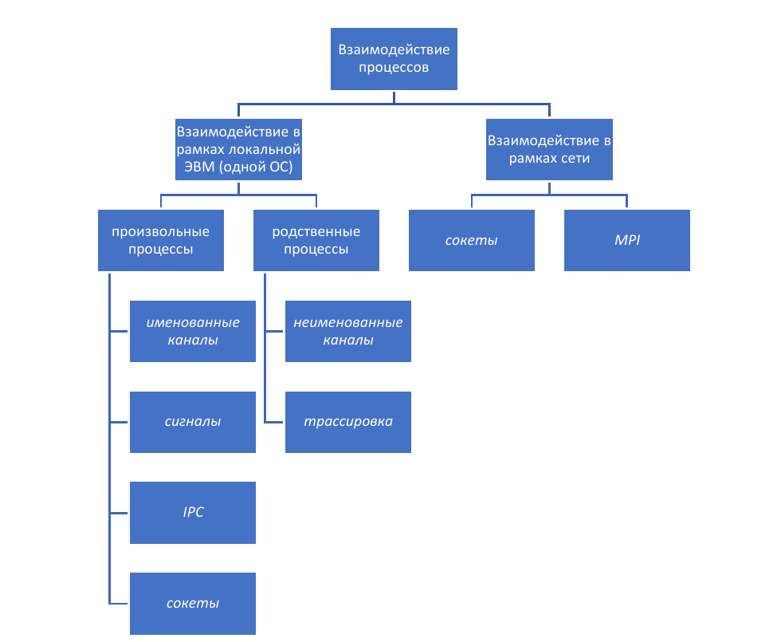
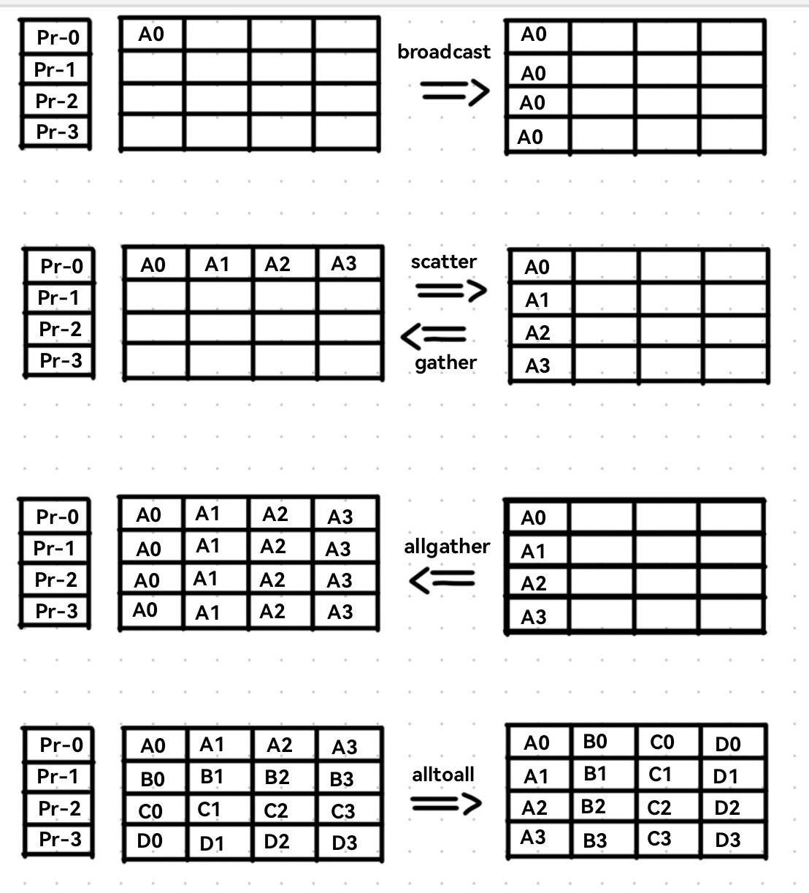

Идея избавиться (правильнее сказать, дополнить ещё одним способом взаимодействия) от синхронизации процессов **по работе** и прийти к синхронизации **по данным** не новая. Первое широкое распространение идей приёма-передачи сообщений было описано в работе Чарльза Энтони Ричарда Хоара "Взаимодействующие последовательные процессы" 1978 года. Его целью было избавиться от проблем разделения памяти и предложить модель
взаимодействия процессов для распределенных систем, основанную на двух ключевых операциях:
 + `send (destination, &message, msize);`
 + `receive ([source], &message, msize);`

С помощью передачи собщений можно решать уже известные нам задачи синхронизации, например, задачу "Производитель-Потребитель":

```c
#define N 100 /* максимальное число сообщений в буфере */
#define msize 4 /* размер сообщения */

void producer() {
	message[msize] m;
	message[msize] item;

	while (TRUE) {
		produce_item(&item);
		receive(consumer, &m, msize); /* получает пустой "контейнер" */
		build_message(&m, item); /* формирует сообщение */
		send(consumer, &m, msize);
	}
}

void consumer() {
	message[msize] m;
	message[msize] item;
	int i;
	
	for (i = 0; i < N; i ++) {
		send(producer, &m, msize); /* посылает все пустые "контейнеры" */
	}

	while (TRUE) {
		receive(producer, &m, msize);
		extract_item(&m, item);
		send(producer, &m, msize); /* возвращает "контейнер" */
		consume_item(item);
	}
}
```

Механизмы семафоров и обмена сообщениями взаимозаменяемы семантически и на мультипроцессорах могут быть реализованы один через другой (В ту же дружную компанию можно вписать и события, которые тоже прекрасно через семафоры (и транзитивно через сообщения) реализуются).

---

Развитие систем взаимодействия процессов от передачи сообщений близкородственными процессами (например, неименованные каналы) до межсетевого взаимодействия (известный нам механизм сокетов) и далее ведут нас к упрощению в управлении и синхронизации работы больших (как по данным, так и по исполняющим потокам) систем. Вот упрощённая схема известных нам методов взаимодействия процессов:



В этой главе нас будут интересовать коммуникационные сети и взаимодействие в них.  Коммуникационные сети подразделяются на **широкомасштабные** (`Wide Area Networks`, `WANs`) и **локальные** (`Local Area Networks`, `LANs`).

# Широкомасштабные сети

`WAN` состоит из коммуникационных ЭВМ, связанных между собой коммуникационными линиями (телефонные линии, радиолинии, спутниковые каналы, оптоволокно) и обеспечивающих транспортировку сообщений. Для сети характерна техника передачи `store-and-forward`, когда сообщения передаются из одного компьютера в следующий с промежуточной буферизацией. Связано это с потенциально большими потерями данных при передаче в `WAN` из-за больших расстояний и множественных изменений формата передачи.

## Коммутация пакетов или коммутация линий. 

Из курса Сетей мы знаем, что при передаче данных используется два способа соединения пользователей - **коммутация линий** и **коммутация пакетов**. \
*Коммутация линий* (телефонные разговоры) требует резервирования линий на время всего сеанса общения двух устройств. *Пакетная коммутация* основана на разбиении сообщений в пункте отправления на порции (пакеты), посылке пакетов по адресу назначения, и сборке сообщения из пакетов в пункте назначения. При этом линии используются эффективнее, сообщения могут передаваться быстрее, но требуется работа по разбиению и сборке сообщений, а также возможны задержки (для передачи медиафайлов или речи такой метод не годится).

## Семиуровневая модель `ISO/OSI`

`ISO OSI` (`International Standards Organizations»s Reference Model of Open Systems Interconnection`) организует коммуникационные протоколы в виде семи уровней и специфицирует функции каждого уровня.

Уровни этой модели располагаются от физической среды передачи данных до прикладного уровня. Gри этом предполагается, что взаимодействие в сети может осуществляться между одноимёнными (одноранговыми) уровнями. для осуществления этого взаимодействия используются протоколы. 

$$Дальше\ кусок\ текста\ из\ ОСей.$$ $$Можно\ его\ пропустить,\ это\ чисто\ для\ вспоминания\ раздел$$

***Протокол*** — это формальное описание сообщений и правил, по которым сетевые устройства (вычислительные системы) осуществляют обмен информацией. Таким образом, протокол обеспечивает взаимодействие в сети между различными сетевыми устройствами на одноимённых уровнях. Любой из уровней может содержать произвольное число протоколов, но общаться могут лишь протоколы одного уровня. Также под протоколом будут пониматься правила взаимодействия одноименных, или одноранговых, уровней. \
***Интерфейс*** — правила взаимодействия вышестоящего уровня с нижестоящим. \
***Служба*** или ***сервис*** — набор операций, предоставляемых нижестоящим уровнем вышестоящему. \
***Стек протоколов*** — перечень разноуровневых (от первого до максимального реализованного) протоколов, реализованных в системе. стек может быть произвольной глубины, т.е. в нем, возможно, не будут представлены протоколы некоторых уровней модели `iso/osi`. 

При осуществлении взаимодействия информация должна быть сначала передана с текущего на первый уровня на данном сетевом устройстве, затем передана по коммуникационной среде, принята на другом сетевом устройстве, и, наконец, поднята до соответствующего уровня на другом сетевом устройстве. Теперь более детально рассмотрим назначение каждого уровня.

***Физический уровень.*** На этом уровне обеспечивается непосредственно передача неструктурированного потока двоичной информации. для передачи используется конкретная физическая среда (кабель, радиоволны и т.п.). на данном уровне декларируется стандартизация сигналов и соединений. 

***Канальный уровень*** (или уровень передачи данных). На этом уровне решаются задачи обеспечения передачи данных по физической линии, обеспечения доступности физической линии, обеспечения синхронизации (например, передающего и принимающего узлов), а также задачи по борьбе с ошибками. Канальный уровень манипулирует порциями данных, которые называются кадрами. В кадрах присутствует избыточная информация для фиксации и устранения ошибок. Таким образом, основная задача канального уровня – обеспечение надёжной линии связи. На канальном уровне также может решаться задача внутренней адресации устройств в локальной сети. 

***Сетевой уровень.*** На этом уровне решаются задачи взаимодействия сетей: обеспечивается управление операциями сети (в т.ч. адресация абонентов, маршрутизация), а также обеспечивается связь между взаимодействующими сетевыми устройствами. Также на этом уровне происходит управление движением пакетов, и при необходимости поддерживается их буферизация. 

***Транспортный уровень.*** На данном уровне обеспечивается корректная транспортировка данных и взаимодействие между программой-отправителем и программой-получателем данных, т.е. обеспечивается программное взаимодействие (а не взаимодействие устройств). На этом же уровне принимается решение о выборе типа транспортных услуг (транспортировка данных с установлением виртуального канала или же без оного). В случае установления виртуального канала осуществляется контроль за фактом доставки и обработка ошибок (при этом взаимодействие программы-отправителя и программы- получателя обеспечивается в терминах сообщений). Если же виртуальный канал не устанавливается, то уровень не несет ответственности за доставку пакетов. На транспортном уровне может обеспечиваться выявление и исправление ошибок при передаче. 

***Сеансовый уровень.*** Этот уровень обеспечивает управление сеансами связи. На этом уровне решаются задачи определения активной стороны, подтверждения полномочий и паролей, а также решаются задачи организации меток, или контрольных точек по сеансу, которые отражают состояние сеанса связи и позволяют в случае возникновения сбоя восстанавливать сеанс с последней контрольной точки (т.е. повторять передачу не с начала, а с последней установленной контрольной точки). 

***Уровень представления данных*** обеспечивает унификацию используемых в сети кодировок и форматов передаваемых данных. 

***Прикладной уровень*** (уровень прикладных программ). На этом уровне формализуются правила взаимодействия с прикладными системами (например, с веб-браузером). Ради этого уровня выстраивается вся структура организации сетевого взаимодействия.

$$Всё,\ мчим\ дальше\ по\ материалу$$

## Локальные сети

Основные собенности `LAN`:
 + Географическая область охвата невелика (здание или несколько зданий);
 + Высокая скорость передачи (100-1000 `Mbps`);
 + Малая вероятность ошибок передачи.

Отсюда следует, что большие накладные расходы, свойственные многоуровневой модели `ISO/OSI`,для `LAN` не нужны, в нём применяются более простые протоколы.


# Аппаратная и программная составляющие обмена сообщениями между прикладными процессами

Рассматривая многопроцессорные системы с распределённой памятью, как частный случай локальной сети, можно применять известные сетевые технологии для спецификации протоколов взаимодействия системы, однако мы стремимся не только настроить разделение и разнесение вычислительной нагрузки, но и организовать именно **распараллеливание** и **единовременное взаимодействие** его частей посредством передачи сообщений.

В середине 80-х годов английская фирма `Inmos` выпустила миникомпьютер, названный **транспьютером**. Его отличительной особенностью является наличие 8-ми каналов (4 входные и 4 выходные) для обмена информацией с другими транспьютерами или другими устройствами, такими как диски, терминалы и т.п. 

```
Решетка транспьютеров, в которой каждый транспьютер параллельно с вычислениями может обмениваться одновременно по 8 каналам с 4 соседями, является хорошим примером, для которого будут формулироваться различные экзаменационные задачи. 
```

Для передачи информации между двумя соседними (связанными одним каналом) узлами транспьютерной матрицы первый узел должен выдать **операцию послать сообщение**, а второй – **операцию принять сообщение**. При этом заданная в операции приема область памяти должна быть по размеру не меньше передаваемого сообщения. Операции посылки и приема сообщения завершаются только после полного завершения передачи сообщения. 

Время передачи сообщения между двумя соседними узлами транспьютерной матрицы определяется двумя характеристиками аппаратуры - **временем старта передачи** $T_s$ и **временем передачи одного байта информации** соседнему узлу $T_b.$ При этом процессорные операции, включая чтение из памяти и запись в память, считаются бесконечно быстрыми. За время $T_s+T_b$ транспьютер может **передать 1 байт информации своим четырем соседям** и **принять от них 4 байта информации** (по одному байту от каждого). Для этого необходимо запустить на нем 8 служебных процессов. Для ускорения передачи сообщений используются **конвейеризация** (разбиение сообщения на кванты, чтобы воспользоваться параллельной работой каналов вдоль маршрута передачи) и **параллельное использование нескольких маршрутов**.

При обмене собщениями ключевыми параметрами функций приёма-передачи являются **адрес получателя/отправителя**, **адрес памяти** отправляемого/получаемого сообщения, а также **его длина**. \
Адресом может выступать физический или логический номер процессора, уникальный идентификатор динамически создаваемого процесса, кроме этогоможет указываться тэг, описывающий службу поиска имён (сервер имён
или широковещание - `broadcasting`).\
Конвейеризация передачи сообщений обеспечивается за счёт тройного копирования данных при пересылке - из памяти процесса-отправителя в буфер ОС на своем компьютере, между буферами ОС, из буфера ОС получателя в память процесса-получателя.\
Сами `send-receive` обладают дополнительными синхронизационными и конвейеризирующими свойствами:
 + Блокирующие (**до освобождения памяти с данными** или **до завершения фактической передачи**) и неблокирующие операции `send`;
 + Буферизуемые и небуферизуемые (`rendezvous` - переотправка до получения - или **с потерей информации при отсутствиии `receive`**) приёмы данных
 + Надёжная и ненадёжная передача данных

# `MPI` - `Message-Passing Interface`

`MPI` (05/05/1994 - ...)- это стандарт взаимодействия процессов путём передачи сообщений, обеспечивающий возможнсть эффективных коммуникаций процессов.

Основные цели разработки `MPI`:
 + **Создать интерфейс прикладного программирования** (не только для компиляторов или библиотек реализации систем);
 + **Обеспечить возможность эффективных коммуникаций** (избежать копирования из памяти в память, позволить совмещение вычислений и коммуникаций или разгрузку на коммуникационный процессор там, где он есть);
 + **Разрешить расширения** для использования в гетерогенной среде;
 + **Исходить из надежности коммуникаций** (пользователь не должен бороться с коммуникационными сбоями - это дело коммуникационных подсистем нижнего уровня);
 + Определить интерфейс, который бы **не слишком отличался от используемых** в то время, таких как `PVM`, `Express`, `P4`, и пр.;
 + Определить интерфейс, который мог бы **быстро быть реализован на многих продаваемых платформах** без серьезной переделки коммуникационного и системного ПО.

`MPI` включает в себя множество протоколов и функций для **коммуникации точка-точка**, **коллективных операций** приёма-передачи, позволяет создавать **группы процессов** и поддерживать **коммуникационные контексты** и **топологии процессов**, а, главное, обеспечивает простое создание процессов для модели `SPMD` (`Single Program - Multiple Data`, одна программа
используется для обработки разных данных на разных процессорах). \
При этом явных операций с разделяемой памятью и явной поддержки процессов с общей памятью (нитей, в частности) `MPI` не обспечивает. Кроме того, в нём отсутствуют вспомогательные функции типа таймеров, и операции, которые требуют больше поддержки от операционных систем,
чем действующие в настоящее время стандарты на ОС (например, получение
сообщений через механизм прерываний, активные сообщения).

Для небольшого погружения в работу `MPI` (для подробного изучения возможностей интерфейса можно воспользоваться книжкой Антонова, она и лекция по `OpenMP` есть в материалах) мы введём некоторые понятия и операции. Примеры к функциям будут выписаны в Дополнениях.

## Терминология

Коммуникационные операции могут быть: 
 + **неблокирущие** процесс - если возврат осуществляется до завершения операции; 
 + **блокирующие** процесс- если возврат означает, что пользователь может использовать ресурсы (например, буфера), указанные в вызове; 

Операция называется 
 + **локальной**, если ее выполнение не требует коммуникаций; 
 + **нелокальной**, если ее выполнение может требовать коммуникаций; 
 + **коллективной**, если в ее выполнении должны участвовать все процессы группы.

**Группа** - упорядоченное (от 0 до ранга группы) множество идентификаторов процессов (т.е. процессов). \
Группы служат для указания адресата при посылке сообщений (процесс-адресат специфицируется своим номером в группе), определяют исполнителей коллективных операций. Являются мощным средством функционального распараллеливания - позволяют разделить группу процессов на несколько подгрупп, каждая из которых должна выполнять свою параллельную процедуру. При этом существенно упрощается проблема адресации при использовании параллельных процедур. 

**Контекст** - область «видимости» для сообщений, аналогичное области видимости переменных в случае вложенных вызовов процедур. Сообщения, посланные в некотором контексте, могут быть приняты только в этом же контексте. Контексты - также важные средства поддержки параллельных процедур. 

**Коммуникаторы** - позволяют ограничить область видимости (жизни, определения) сообщений рамками некоторой группы процессов, т.е. могут рассматриваться как _пара - группа и контекст_. Кроме того, они служат и для целей оптимизации, храня необходимые для этого дополнительные объекты.

## Работа с коммуникаторами

При инициализации `MPI`-системы cоздаются предопределенные коммуникаторы:
 + `MPI_COMM_WORLD` - самый важный и наиболее часто используемый коммуникатор, представляющий собой группу, состоящую из всех процессов, запущенных в параллельной программе;
 + `MPI_COMM_SELF` - коммуникатор, содержащий только один процесс – тот, который вызывает функцию. Каждый процесс имеет свой собственный, уникальный `MPI_COMM_SELF`.

Мы также можем создавать собственные коммуникаторы и проводить операции над ними. Для этого часто используются функции, заточенные на работу с коммутаторами$^1$:
 + `MPI_Comm_rank`: Возвращает ранг процесса в данном коммуникаторе.
 + `MPI_Comm_size`: Возвращает число процессов в данном коммуникаторе.
 + `MPI_Comm_split`: Разделяет коммуникатор на несколько новых коммуникаторов на основе критериев, заданных пользователем.
 + `MPI_Comm_create`: Создаёт новый коммуникатор на основе существующего, с дополнительными параметрами.
 + `MPI_Comm_free`: Освобождает ресурсы, выделенные для коммуникатора.

## Точечные коммуникации

С помощью `MPI` процессы могут передавать информацию друг другу путём точечных коммуникаций `MPI_Send`, `MPI_Recv` и их объединения `MPI_Sendrecv`$^2$.

**Аргументы** `MPI_Send`:
 + `buf`: Указатель на буфер, содержащий данные для отправки.
 + `count`: Количество элементов, которые необходимо отправить.
 + `datatype`: Тип данных отправляемых элементов (например, `MPI_INT`, `MPI_DOUBLE`).
 + `dest`: Ранг процесса, которому отправляется сообщение.
 + `tag`: Тег сообщения (целое число, используемое для идентификации сообщения).
 + `comm`: Коммуникатор (группа процессов, участвующих в обмене сообщениями).

**Аргументы** `MPI_Recv`:
 + `buf`: Указатель на буфер, в который будут помещены принятые данные.
 + `count`: Максимальное количество элементов, которое может быть принято.
 + `datatype`: Тип данных принимаемых элементов (должен соответствовать типу данных отправляемых элементов).
 + `source`: Ранг процесса, от которого ожидается получение сообщения. Можно использовать `MPI_ANY_SOURCE` для получения сообщения от любого процесса.
 + `tag`: Тег сообщения, которое ожидается получить. Можно использовать `MPI_ANY_TAG` для приема сообщения с любым тегом.
 + `comm`: Коммуникатор.
 + `status`: Указатель на структуру `MPI_Status`, которая заполняется информацией о полученном сообщении (например, ранг отправителя, тег, реальное количество полученных элементов).


**Аргументы** `MPI_Sendrecv`:
 + `sendbuf`: Указатель на буфер отправляемых данных.
 + `sendcount`: Количество элементов для отправки.
 + `sendtype`: Тип данных отправляемых элементов.
 + `dest`: Ранг процесса-получателя.
 + `sendtag`: Тег отправляемого сообщения.
 + `recvbuf`: Указатель на буфер для приема данных.
 + `recvcount`: Максимальное количество элементов для приема.
 + `recvtype`: Тип данных принимаемых элементов.
 + `source`: Ранг процесса-отправителя.
 + `recvtag`: Тег принимаемого сообщения.
 + `comm`: Коммуникатор.
 + `status`:  Структура `MPI_Status`, которая заполняется информацией о полученном сообщении.

При работе в гетерогенной среде производится автоматическая конвертация данных.

При точечных коммуникациях возможно четыре ***режима коммуникаций***: \
В **стандартном режиме** последовательность выдачи операций `send` и `receive` произвольна, операция `send` завершается тогда, когда сообщение изъято из памяти процесса (например, переписано в системный буфер), и эта память уже может использоваться процессом. При этом выполнение операции может осуществляться независимо от наличия `receive`, либо требовать наличие (вопрос реализации `MPI`). Поэтому операция считается **нелокальной**. \
В **буферизуемом режиме** последовательность выдачи операций `send` и `receive` произвольна, операция `send` завершается тогда, когда сообщение изъято из памяти и помещено в буфер, предварительно заведенный в памяти процесса. Если места в буфере нет - ошибка программы (но есть возможность определить свой буфер). Операция **локальная**. \
В **синхронном режиме** последовательность выдачи операций произвольна, но операция `send` завершается только после выдачи и начала выполнения операции `receive`. Для этого посылающая сторона запрашивает у принимающей стороны подтверждение выдачи операции `receive`. Операция **нелокальная**. \
В **режиме готовности** операция `send` может быть выдана только после выдачи соответствующей операции `receive`, иначе программа считается ошибочной и результат ее работы не определен. Операция **нелокальная**. 

Во всех четырех режимах операция `receive` завершается после получения сообщения в заданный пользователем буфер приема. 
 + Неблокирующие операции не приостанавливают процесс до своего завершения, а возвращают ссылку на коммуникационный объект, позволяющий опрашивать состояние операции или дожидаться ее окончания. 
 + Имеются операции проверки поступающих процессу сообщений, без чтения их в буфер (например, для определения длины сообщения и запроса затем памяти под него).
 + Имеется возможность аварийно завершать выданные неблокирующие операции, и поэтому предоставлены возможности проверки, хорошо ли завершились операции.
 + Имеется составная операция `send`-`receive`, позволяющая избежать трудностей с порядком выдачи отдельных операций в обменивающихся между собой процессах. Для частного случая обмена данными одного типа и длины предлагается специальная операция (`send`-`receive`-`replace`), в которой для посылки и приема сообщения используется один буфер.

## Групповые коммуникации

 Главная особенность `MPI` - возможность проведения **коллективных коммуникаций**$^3$ процессов:
  + передача сообщения всем членам группы от одного (`BROADCAST`); 
  + сбор данных от всех членов группы для одного (`GATHER`); 
  + рассылка данных всем членам группы от одного (`SCATTER`); 
  + сбор данных от всех членов группы для всех (`ALLGATHER`); 
  + рассылка данных всем членам группы от всех (`ALLTOALL`); 
  + глобальные операции (сумма, максимум, и т.п.), когда результат сообщается всем членам группы (`ALLREDUCE`) или только одному(`REDUCE`).

Графически работу групповых коммуникаций можно проиллюстрировать вот так:




## `MPI-2` (1997 г.)

`MPI-2` развивает `MPI` в следующих направлениях:
 + **Динамическое создание и уничтожение процессов** (важно для работы в сетях ЭВМ).
 + **Односторонние коммуникации** и средства синхронизации для организации взаимодействия процессов через общую память (для эффективной работы на системах с непосредственным доступом процессоров к памяти других процессоров).
 + **Параллельные операции ввода-вывода** (для эффективного использования существующих возможностей параллельного доступа многих процессоров к различным дисковым устройствам).

# `PVM` (`Parallel Virtual Machine`)

Широко известная система `PVM` была создана для объединения нескольких связанных сетью рабочих станций в единую виртуальную параллельную ЭВМ. Система представляет собой надстройку над операционной системой `UNIX` и используется в настоящее время на различных аппаратных платформах, включая и ЭВМ с массовым параллелизмом. \
Задача пользователя в такой системе представляется множеством подзадач, которые динамически создаются на указанных процессорах распределенной системы и взаимодействуют между собой путем передачи и приема сообщений (а также посредством механизма сигналов).

***Достоинства*** такой системы - её **простота**, **наличие** наследованного от `OS UNIX` **аппарата процессов и сигналов**, а также **возможность динамического добавления** к группе вновь созданных процессов. ***Недостатками*** системы выступают **низкая производительность** и **функциональная ограниченность** (например, имеется только один режим передачи сообщений - с буферизацией).


---

# Дополнения:

## 1. Примеры программ с функциями для работы с коммутаторами

`mpi_comm_world.c`
```c
#include <mpi.h>
#include <stdio.h>

/*
Этот пример показывает, как использовать MPI_COMM_WORLD 
для получения ранга процесса и размера коммуникатора.
*/

int main(int argc, char** argv) {
    MPI_Init(&argc, &argv);

    int rank, size;

    // Получаем ранг процесса в MPI_COMM_WORLD
    MPI_Comm_rank(MPI_COMM_WORLD, &rank);

    // Получаем размер коммуникатора MPI_COMM_WORLD (общее количество процессов)
    MPI_Comm_size(MPI_COMM_WORLD, &size);

    printf("Process %d of %d: Hello from MPI_COMM_WORLD\n", rank, size);

    MPI_Finalize();
    return 0;
}
```

```console
mpirun -n 4 ./mpi_comm_world

Process 2 of 4: Hello from MPI_COMM_WORLD
Process 1 of 4: Hello from MPI_COMM_WORLD
Process 0 of 4: Hello from MPI_COMM_WORLD
Process 3 of 4: Hello from MPI_COMM_WORLD
```


`mpi_comm_self.c`
```c
#include <mpi.h>
#include <stdio.h>

/*
Этот пример показывает, как использовать MPI_COMM_SELF
 для выполнения локальной операции 
 (в данном случае, просто вывод сообщения).
*/

int main(int argc, char** argv) {
    MPI_Init(&argc, &argv);

    int rank;
    MPI_Comm_rank(MPI_COMM_WORLD, &rank);

    printf("Process %d: Working with MPI_COMM_SELF\n", rank);

    // Пример локальной операции - просто выводим сообщение
    int local_rank;
    MPI_Comm_rank(MPI_COMM_SELF, &local_rank);
    printf("Process %d (local_rank): My local rank is %d\n", rank, local_rank);

    MPI_Finalize();
    return 0;
}
```

```console
mpirun -n 4 ./mpi_comm_self

Process 0: Working with MPI_COMM_SELF
Process 0 (local_rank): My local rank is 0
Process 1: Working with MPI_COMM_SELF
Process 1 (local_rank): My local rank is 0
Process 3: Working with MPI_COMM_SELF
Process 3 (local_rank): My local rank is 0
Process 2: Working with MPI_COMM_SELF
Process 2 (local_rank): My local rank is 0
```


`mpi_comm_split.c`
```c
#include <mpi.h>
#include <stdio.h>

/*
Этот пример демонстрирует разделение MPI_COMM_WORLD
 на два новых коммуникатора на основе чётности ранга процесса.
*/

int main(int argc, char** argv) {
    MPI_Init(&argc, &argv);

    int rank, size, new_rank, new_size, color;
    MPI_Comm new_comm;

    MPI_Comm_rank(MPI_COMM_WORLD, &rank);
    MPI_Comm_size(MPI_COMM_WORLD, &size);

    // Определяем цвет для разделения. Четные процессы - цвет 0, нечетные - цвет 1
    color = rank % 2;

    // Разделяем коммуникатор MPI_COMM_WORLD
    MPI_Comm_split(MPI_COMM_WORLD, color, rank, &new_comm);


    if (new_comm != MPI_COMM_NULL) {
        // Получаем ранг и размер нового коммуникатора
        MPI_Comm_rank(new_comm, &new_rank);
        MPI_Comm_size(new_comm, &new_size);

        if (color == 0) {
           printf("Even process %d (rank %d in MPI_COMM_WORLD):  New rank %d, total size in new_comm = %d\n", rank, rank, new_rank, new_size);
        } else {
           printf("Odd process %d (rank %d in MPI_COMM_WORLD): New rank %d, total size in new_comm = %d\n", rank, rank, new_rank, new_size);
        }

        // Освобождаем ресурсы, выделенные для нового коммуникатора
        MPI_Comm_free(&new_comm);
    }

    MPI_Finalize();
    return 0;
}
```

```console
mpirun -n 4 ./mpi_comm_split

Odd process 1 (rank 1 in MPI_COMM_WORLD): New rank 0, total size in new_comm = 2
Even process 0 (rank 0 in MPI_COMM_WORLD):  New rank 0, total size in new_comm = 2
Even process 2 (rank 2 in MPI_COMM_WORLD):  New rank 1, total size in new_comm = 2
Odd process 3 (rank 3 in MPI_COMM_WORLD): New rank 1, total size in new_comm = 2

```


`mpi_comm_create.c`
```c
#include <mpi.h>
#include <stdio.h>

/*
Этот пример показывает, как создать новый коммуникатор,
 который будет включать только процессы с определенными рангами.
*/

int main(int argc, char** argv) {
    MPI_Init(&argc, &argv);

    int rank, size;
    MPI_Group world_group, new_group;
    MPI_Comm new_comm;

    MPI_Comm_rank(MPI_COMM_WORLD, &rank);
    MPI_Comm_size(MPI_COMM_WORLD, &size);

    // Получаем группу процессов из MPI_COMM_WORLD
    MPI_Comm_group(MPI_COMM_WORLD, &world_group);

    // Определяем ранги процессов, которые мы хотим включить в новую группу
    int ranks_to_include[] = {0, size / 2, size - 1};
    int num_ranks_to_include = sizeof(ranks_to_include) / sizeof(ranks_to_include[0]);

    // Создаём новую группу
    MPI_Group_incl(world_group, num_ranks_to_include, ranks_to_include, &new_group);

    // Создаём новый коммуникатор
    MPI_Comm_create(MPI_COMM_WORLD, new_group, &new_comm);

    if (new_comm != MPI_COMM_NULL) {
        int new_rank, new_size;
        MPI_Comm_rank(new_comm, &new_rank);
        MPI_Comm_size(new_comm, &new_size);
        printf("Process %d (world rank): New comm rank %d, new comm size %d\n", rank, new_rank, new_size);

        MPI_Comm_free(&new_comm);
    } else {
        printf("Process %d (world rank): Not in new comm\n", rank);
    }

    // Освобождаем ресурсы
    MPI_Group_free(&world_group);
    MPI_Group_free(&new_group);

    MPI_Finalize();
    return 0;
}
```

```console
mpirun -n 4 ./mpi_comm_world

Process 2 of 4: Hello from MPI_COMM_WORLD
Process 1 of 4: Hello from MPI_COMM_WORLD
Process 0 of 4: Hello from MPI_COMM_WORLD
Process 3 of 4: Hello from MPI_COMM_WORLD
```


## 2. Примеры программ с точечными коммуникациями

`send_recv_array.c`
```c
#include <stdio.h>
#include <mpi.h>

// Отправка и прием массива данных

int main(int argc, char **argv) {
    int rank, size;
    int data[5];
    MPI_Status status;

    MPI_Init(&argc, &argv);
    MPI_Comm_rank(MPI_COMM_WORLD, &rank);
    MPI_Comm_size(MPI_COMM_WORLD, &size);

    if (size < 2) {
        fprintf(stderr, "Требуется минимум 2 процесса\n");
        MPI_Finalize();
        return 1;
    }

    if (rank == 0) {
        // Отправляем массив от процесса 0 процессу 1
        for (int i = 0; i < 5; ++i) {
            data[i] = i * 2;
        }
        MPI_Send(data, 5, MPI_INT, 1, 0, MPI_COMM_WORLD);
        printf("Процесс %d отправил массив процессу 1\n", rank);
    } else if (rank == 1) {
        // Получаем массив от процесса 0
        MPI_Recv(data, 5, MPI_INT, 0, 0, MPI_COMM_WORLD, &status);
        printf("Процесс %d получил массив от процесса 0: ", rank);
        for (int i = 0; i < 5; ++i) {
            printf("%d ", data[i]);
        }
        printf("\n");
    }

    MPI_Finalize();
    return 0;
}
```

```console
mpirun -n 2 ./send_recv_array

Процесс 0 отправил массив процессу 1
Процесс 1 получил массив от процесса 0: 0 2 4 6 8
```


`send_recv_tags.c`
```c
#include <stdio.h>
#include <mpi.h>

// Использование тегов для различения сообщений

int main(int argc, char** argv)
{
    int rank, size;
    int data;
    MPI_Status status;

    MPI_Init(&argc, &argv);
    MPI_Comm_rank(MPI_COMM_WORLD, &rank);
    MPI_Comm_size(MPI_COMM_WORLD, &size);

    if (size < 2) {
        fprintf(stderr, "Требуется минимум 2 процесса\n");
        MPI_Finalize();
        return 1;
    }

    if (rank == 0) {
        // Отправляем два сообщения процессу 1 с разными тегами
        data = 10;
        MPI_Send(&data, 1, MPI_INT, 1, 1, MPI_COMM_WORLD); // Тег 1
        printf("Процесс %d отправил сообщение с тегом 1 процессу 1\n", rank);

        data = 20;
        MPI_Send(&data, 1, MPI_INT, 1, 2, MPI_COMM_WORLD); // Тег 2
        printf("Процесс %d отправил сообщение с тегом 2 процессу 1\n", rank);
    } else if (rank == 1) {
        // Получаем сообщение с тегом 2 от процесса 0
        MPI_Recv(&data, 1, MPI_INT, 0, 2, MPI_COMM_WORLD, &status);
        printf("Процесс %d получил сообщение с тегом 2 от процесса 0: %d\n", rank, data);

        // Получаем сообщение с тегом 1 от процесса 0
        MPI_Recv(&data, 1, MPI_INT, 0, 1, MPI_COMM_WORLD, &status);
        printf("Процесс %d получил сообщение с тегом 1 от процесса 0: %d\n", rank, data);
    }

    MPI_Finalize();
    return 0;
}
```

```console
mpirun -n 2 ./send_recv_tags

Процесс 0 отправил сообщение с тегом 1 процессу 1
Процесс 0 отправил сообщение с тегом 2 процессу 1
Процесс 1 получил сообщение с тегом 2 от процесса 0: 20
Процесс 1 получил сообщение с тегом 1 от процесса 0: 10
```


`send_recv_any.c`
```c
#include <stdio.h>
#include <mpi.h>

//Получение данных любого типа с использованием MPI_ANY_SOURCE и MPI_ANY_TAG


int main(int argc, char** argv) {
    int rank, size;
    int data;
    MPI_Status status;

    MPI_Init(&argc, &argv);
    MPI_Comm_rank(MPI_COMM_WORLD, &rank);
    MPI_Comm_size(MPI_COMM_WORLD, &size);

    if (size < 2) {
        fprintf(stderr, "Требуется минимум 2 процесса\n");
        MPI_Finalize();
        return 1;
    }

    if (rank == 0) {
        // Отправляем сообщение процессу 1
        data = 100;
        MPI_Send(&data, 1, MPI_INT, 1, 5, MPI_COMM_WORLD);
        printf("Процесс %d отправил сообщение процессу 1 с тегом 5\n", rank);

    } else if (rank == 1) {
        // Получаем сообщение от любого процесса с любым тегом
        MPI_Recv(&data, 1, MPI_INT, MPI_ANY_SOURCE, MPI_ANY_TAG, MPI_COMM_WORLD, &status);

        printf("Процесс %d получил сообщение от процесса %d с тегом %d: %d\n", rank, status.MPI_SOURCE, status.MPI_TAG, data);
    }

    MPI_Finalize();
    return 0;
}
```

```console
mpirun -n 2 ./send_recv_any

Процесс 0 отправил сообщение процессу 1 с тегом 5
Процесс 1 получил сообщение от процесса 0 с тегом 5: 100
```


`send_recv_combined.c`
```c
#include <stdio.h>
#include <mpi.h>

// Пример использования MPI_Sendrecv


int main(int argc, char** argv) {
    int rank, size;
    int send_data, recv_data;
    int target_rank, source_rank;
    int send_tag, recv_tag;
    MPI_Status status;

    MPI_Init(&argc, &argv);
    MPI_Comm_rank(MPI_COMM_WORLD, &rank);
    MPI_Comm_size(MPI_COMM_WORLD, &size);

    if (size < 2) {
        fprintf(stderr, "Требуется минимум 2 процесса\n");
        MPI_Finalize();
        return 1;
    }

    // Определяем, кому отправлять и от кого получать
    if (rank == 0) {
        target_rank = 1;
        source_rank = 1;
        send_tag = 10;
        recv_tag = 20;
        send_data = 100;

        MPI_Sendrecv(&send_data, 1, MPI_INT, target_rank, send_tag,
            &recv_data, 1, MPI_INT, source_rank, recv_tag,
            MPI_COMM_WORLD, &status);

        printf("Процесс %d отправил %d процессу %d (тег %d) и получил %d от процесса %d (тег %d)\n",
            rank, send_data, target_rank, send_tag, recv_data, source_rank, recv_tag);

    } else if (rank == 1) {
        target_rank = 0;
        source_rank = 0;
        send_tag = 20;
        recv_tag = 10;
        send_data = 200;


        MPI_Sendrecv(&send_data, 1, MPI_INT, target_rank, send_tag,
            &recv_data, 1, MPI_INT, source_rank, recv_tag,
            MPI_COMM_WORLD, &status);


        printf("Процесс %d отправил %d процессу %d (тег %d) и получил %d от процесса %d (тег %d)\n",
            rank, send_data, target_rank, send_tag, recv_data, source_rank, recv_tag);
    }

    MPI_Finalize();
    return 0;
}
```

```console
mpirun -n 2 ./send_recv_combined

Процесс 0 отправил 100 процессу 1 (тег 10) и получил 200 от процесса 1 (тег 20)
Процесс 1 отправил 200 процессу 0 (тег 20) и получил 100 от процесса 0 (тег 10)
```


## 3. Примеры программ с групповыми коммуникациями

`mpi_bcast.c`
```c
#include <stdio.h>
#include <mpi.h>

int main(int argc, char** argv) {
    int rank, size;
    int data; // Данные для рассылки

    MPI_Init(&argc, &argv);
    MPI_Comm_rank(MPI_COMM_WORLD, &rank);
    MPI_Comm_size(MPI_COMM_WORLD, &size);

    if (rank == 0) {
        // Только процесс 0 инициализирует данные
        data = 12345;
        printf("Процесс %d: Начальное значение data = %d\n", rank, data);
    }

    // Рассылаем данные от процесса 0 всем остальным процессам
    MPI_Bcast(&data, 1, MPI_INT, 0, MPI_COMM_WORLD);

    printf("Процесс %d: Значение data после Bcast = %d\n", rank, data);

    MPI_Finalize();
    return 0;
}
```

```console
mpirun -np 4 ./mpi_bcast

Процесс 0: Начальное значение data = 12345
Процесс 0: Значение data после Bcast = 12345
Процесс 2: Значение data после Bcast = 12345
Процесс 1: Значение data после Bcast = 12345
Процесс 3: Значение data после Bcast = 12345
```


`mpi_scatter.c`
```c
#include <stdio.h>
#include <stdlib.h>  // Для malloc и free
#include <mpi.h>

int main(int argc, char** argv) {
    int rank, size;
    int* sendbuf = NULL; // Буфер для отправки (только у процесса 0)
    int* recvbuf;        // Буфер для приема
    int sendcount, recvcount; // Количество элементов для отправки/приема
    int i;

    MPI_Init(&argc, &argv);
    MPI_Comm_rank(MPI_COMM_WORLD, &rank);
    MPI_Comm_size(MPI_COMM_WORLD, &size);

    sendcount = 4;  // Количество элементов, отправляемых каждому процессу
    recvcount = sendcount; // Каждый процесс принимает столько же, сколько отправляется

    // Выделяем память для приемного буфера
    recvbuf = (int*)malloc(recvcount * sizeof(int));
    if (recvbuf == NULL) {
        fprintf(stderr, "Ошибка выделения памяти для recvbuf\n");
        MPI_Abort(MPI_COMM_WORLD, 1);
    }

    // Выделяем память и заполняем данными только на процессе 0
    if (rank == 0) {
        sendbuf = (int*)malloc(size * sendcount * sizeof(int));
        if (sendbuf == NULL) {
            fprintf(stderr, "Ошибка выделения памяти для sendbuf\n");
            MPI_Abort(MPI_COMM_WORLD, 1);
        }
        for (i = 0; i < size * sendcount; ++i) {
            sendbuf[i] = i; // Заполняем данными
        }
        printf("Процесс %d: sendbuf заполнен данными.\n", rank);
    }

    // Разбрасываем данные от процесса 0 всем остальным процессам
    MPI_Scatter(sendbuf, sendcount, MPI_INT, recvbuf, recvcount, MPI_INT, 0, MPI_COMM_WORLD);

    printf("Процесс %d: recvbuf после Scatter: ", rank);
    for (i = 0; i < recvcount; ++i) {
        printf("%d ", recvbuf[i]);
    }
    printf("\n");

    // Освобождаем выделенную память
    free(recvbuf);
    if (rank == 0) {
        free(sendbuf);
    }

    MPI_Finalize();
    return 0;
}
```

```console
mpirun -np 4 ./mpi_scatter

Процесс 0: sendbuf заполнен данными.
Процесс 0: recvbuf после Scatter: 0 1 2 3 
Процесс 2: recvbuf после Scatter: 8 9 10 11 
Процесс 3: recvbuf после Scatter: 12 13 14 15 
Процесс 1: recvbuf после Scatter: 4 5 6 7 
```


`mpi_gather.c`
```c
#include <stdio.h>
#include <stdlib.h>
#include <mpi.h>

int main(int argc, char** argv) {
    int rank, size;
    int* sendbuf;    // Буфер для отправки (у каждого процесса)
    int* recvbuf = NULL; // Буфер для приема (только у процесса 0)
    int sendcount, recvcount;
    int i;

    MPI_Init(&argc, &argv);
    MPI_Comm_rank(MPI_COMM_WORLD, &rank);
    MPI_Comm_size(MPI_COMM_WORLD, &size);

    sendcount = 2; // Количество элементов, отправляемых каждым процессом
    recvcount = sendcount * size; // Количество элементов, принимаемых на процессе 0

    // Выделяем память для отправляемого буфера
    sendbuf = (int*)malloc(sendcount * sizeof(int));
    if (sendbuf == NULL) {
        fprintf(stderr, "Ошибка выделения памяти для sendbuf\n");
        MPI_Abort(MPI_COMM_WORLD, 1);
    }
    for (i = 0; i < sendcount; ++i) {
        sendbuf[i] = rank * 10 + i; // Заполняем данными, зависящими от ранга
    }

    // Выделяем память для принимающего буфера только на процессе 0
    if (rank == 0) {
        recvbuf = (int*)malloc(recvcount * sizeof(int));
        if (recvbuf == NULL) {
            fprintf(stderr, "Ошибка выделения памяти для recvbuf\n");
            MPI_Abort(MPI_COMM_WORLD, 1);
        }
    }

    // Собираем данные от всех процессов на процессе 0
    MPI_Gather(sendbuf, sendcount, MPI_INT, recvbuf, sendcount, MPI_INT, 0, MPI_COMM_WORLD);

    if (rank == 0) {
        printf("Процесс %d: recvbuf после Gather: ", rank);
        for (i = 0; i < recvcount; ++i) {
            printf("%d ", recvbuf[i]);
        }
        printf("\n");
    }

    // Освобождаем выделенную память
    free(sendbuf);
    if (rank == 0) {
        free(recvbuf);
    }

    MPI_Finalize();
    return 0;
}
```

```console
mpirun -np 4 ./mpi_gather

Процесс 0: recvbuf после Gather: 0 1 10 11 20 21 30 31 
```


`mpi_allgather.c`
```c
#include <stdio.h>
#include <stdlib.h>
#include <mpi.h>

int main(int argc, char** argv) {
    int rank, size;
    int* sendbuf;  // Буфер для отправки (у каждого процесса)
    int* recvbuf;  // Буфер для приема (у каждого процесса)
    int sendcount, recvcount;
    int i;

    MPI_Init(&argc, &argv);
    MPI_Comm_rank(MPI_COMM_WORLD, &rank);
    MPI_Comm_size(MPI_COMM_WORLD, &size);

    sendcount = 2; // Количество элементов для отправки
    recvcount = sendcount * size; // Общее количество элементов, которое получает каждый процесс

    // Выделяем память для отправляемого и принимающего буферов у каждого процесса
    sendbuf = (int*)malloc(sendcount * sizeof(int));
    recvbuf = (int*)malloc(recvcount * sizeof(int));
    if (sendbuf == NULL || recvbuf == NULL) {
        fprintf(stderr, "Ошибка выделения памяти\n");
        MPI_Abort(MPI_COMM_WORLD, 1);
    }

    // Заполняем отправляемый буфер данными, зависящими от ранга
    for (i = 0; i < sendcount; ++i) {
        sendbuf[i] = rank * 10 + i;
    }

    // Собираем данные от всех процессов и рассылаем копию каждому процессу
    MPI_Allgather(sendbuf, sendcount, MPI_INT, recvbuf, sendcount, MPI_INT, MPI_COMM_WORLD);

    printf("Процесс %d: recvbuf после Allgather: ", rank);
    for (i = 0; i < recvcount; ++i) {
        printf("%d ", recvbuf[i]);
    }
    printf("\n");

    // Освобождаем выделенную память
    free(sendbuf);
    free(recvbuf);

    MPI_Finalize();
    return 0;
}
```

```console
mpirun -np 4 ./mpi_allgather

Процесс 0: recvbuf после Allgather: 0 1 10 11 20 21 30 31 
Процесс 2: recvbuf после Allgather: 0 1 10 11 20 21 30 31 
Процесс 1: recvbuf после Allgather: 0 1 10 11 20 21 30 31 
Процесс 3: recvbuf после Allgather: 0 1 10 11 20 21 30 31
```


`mpi_alltoall.c`
```c
#include <stdio.h>
#include <stdlib.h>
#include <mpi.h>

int main(int argc, char** argv) {
    int rank, size;
    int* sendbuf;
    int* recvbuf;
    int sendcount, recvcount;
    int i;

    MPI_Init(&argc, &argv);
    MPI_Comm_rank(MPI_COMM_WORLD, &rank);
    MPI_Comm_size(MPI_COMM_WORLD, &size);

    sendcount = 1; // Количество элементов, отправляемых *каждому* процессу
    recvcount = 1; // Количество элементов, принимаемых *от каждого* процесса

    // Выделяем память для буферов отправки и приема
    sendbuf = (int*)malloc(size * sendcount * sizeof(int));
    recvbuf = (int*)malloc(size * recvcount * sizeof(int));
    if (sendbuf == NULL || recvbuf == NULL) {
        fprintf(stderr, "Ошибка выделения памяти\n");
        MPI_Abort(MPI_COMM_WORLD, 1);
    }

    // Заполняем sendbuf.  sendbuf[i] содержит данные, которые будут отправлены процессу i.
    for (i = 0; i < size; ++i) {
        sendbuf[i] = rank * 10 + i; // Данные, зависящие от ранга и целевого процесса
    }

    // Каждый процесс отправляет данные всем остальным процессам
    MPI_Alltoall(sendbuf, sendcount, MPI_INT, recvbuf, recvcount, MPI_INT, MPI_COMM_WORLD);

    printf("Процесс %d: recvbuf после Alltoall: ", rank);
    for (i = 0; i < size; ++i) {
        printf("%d ", recvbuf[i]); // recvbuf[i] содержит данные, полученные от процесса i
    }
    printf("\n");

    // Освобождаем выделенную память
    free(sendbuf);
    free(recvbuf);

    MPI_Finalize();
    return 0;
}
```

```console
mpirun -np 4 ./mpi_alltoall

Процесс 1: recvbuf после Alltoall: 1 11 21 31 
Процесс 3: recvbuf после Alltoall: 3 13 23 33 
Процесс 2: recvbuf после Alltoall: 2 12 22 32 
Процесс 0: recvbuf после Alltoall: 0 10 20 30 
```


`mpi_reduce.c`
```c
#include <stdio.h>
#include <stdlib.h>
#include <mpi.h>

int main(int argc, char** argv) {
    int rank, size;
    int sendbuf;
    int recvbuf;

    MPI_Init(&argc, &argv);
    MPI_Comm_rank(MPI_COMM_WORLD, &rank);
    MPI_Comm_size(MPI_COMM_WORLD, &size);

    sendbuf = rank + 1; // Каждый процесс отправляет свой ранг + 1

    // Выполняем суммирование всех sendbuf на процессе 0
    MPI_Reduce(&sendbuf, &recvbuf, 1, MPI_INT, MPI_SUM, 0, MPI_COMM_WORLD);

    if (rank == 0) {
        printf("Процесс %d: Сумма всех значений = %d\n", rank, recvbuf);
    }

    MPI_Finalize();
    return 0;
}
```

```console
mpirun -np 4 ./mpi_reduce

Процесс 0: Сумма всех значений = 10
```


`mpi_allreduce.c`
```c
#include <stdio.h>
#include <stdlib.h>
#include <mpi.h>

int main(int argc, char** argv) {
    int rank, size;
    int sendbuf;
    int recvbuf;

    MPI_Init(&argc, &argv);
    MPI_Comm_rank(MPI_COMM_WORLD, &rank);
    MPI_Comm_size(MPI_COMM_WORLD, &size);

    sendbuf = rank + 1; // Каждый процесс отправляет свой ранг + 1

    // Выполняем суммирование всех sendbuf и рассылаем результат всем процессам
    MPI_Allreduce(&sendbuf, &recvbuf, 1, MPI_INT, MPI_SUM, MPI_COMM_WORLD);

    printf("Процесс %d: Сумма всех значений = %d\n", rank, recvbuf);

    MPI_Finalize();
    return 0;
}
```

```console
mpirun -np 4 ./mpi_allreduce

Процесс 2: Сумма всех значений = 10
Процесс 0: Сумма всех значений = 10
Процесс 1: Сумма всех значений = 10
Процесс 3: Сумма всех значений = 10
```
