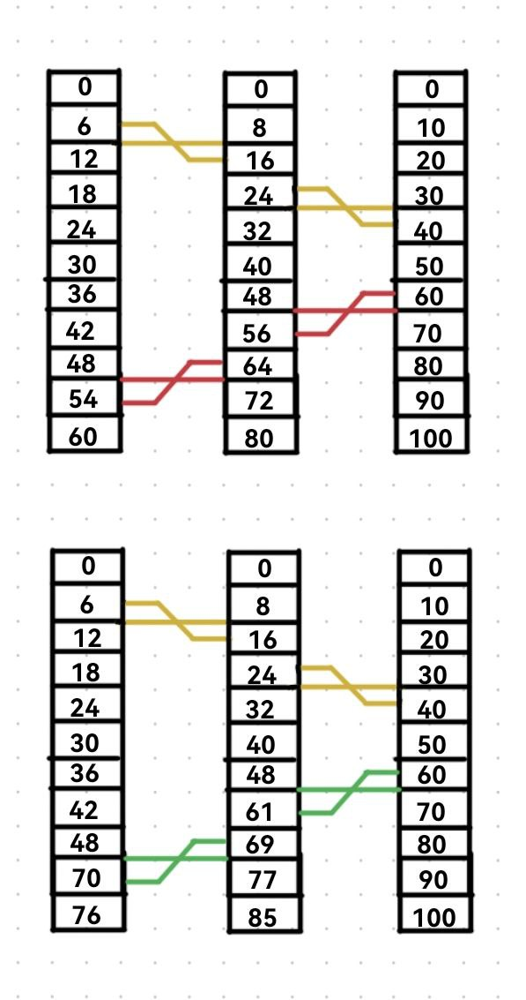

Мы уже разбирали с вами 4 основных свойства децентрализованных алгоритмов в распределённых системах:
 + Относящаяся к делу информация распределена среди множества ЭВМ;
 + Процессы принимают решение на основе только локальной информации;
 + Не должно быть единственной критической точки, выход из строя которой приводил бы к краху алгоритма;
 + Не существует общих часов или другого источника точного глобального времени. 

Первые три пункта все говорят о недопустимости сбора всей информации для принятия решения в одно место. Обеспечение синхронизации без централизации требует подходов, отличных от используемых в традиционных ОС. Последний пункт также очень важен - в распределенных системах достигнуть согласия относительно времени совсем непросто. А важность наличия единого времени огромна. Чего стоит, например, работа утилиты `make` в ОС `UNIX`, которая использует проверку времени последнего изменения исходников и целей для корректировки рецептов.

# Синхронизация времени

Аппаратные часы (правильнее, конечно, называть их **таймером**, так как они представляют собой счётчик временных сигналов и регистр с начальным значением счётчика) основаны на кварцевом генераторе и могут в разных ЭВМ различаться по частоте. Кроме этого, накладываем сюда теорию относительности и многие внешние факторы, и получаем, будто синхронизации часов достичь просто невозможно.

В 1978 году `Lamport` показал, что синхронизация времени возможна, и предложил алгоритм для такой синхронизации. При этом он указал, что абсолютной синхронизации не требуется. Если два процесса не взаимодействуют, то единого времени им не требуется. Кроме того, в большинстве случаев согласованное время может не иметь ничего общего с астрономическим временем, которое объявляется по радио. \
В таких случаях можно говорить о **логических часах**. Для синхронизации логических часов Lamport определил отношение ***«произошло до»***. Выражение $a \rightarrow b$ читается как _«a произошло до b»_ и означает, что все процессы согласны, что сначала произошло событие «a», а затем «b». Это отношение может в двух случаях быть очевидным:
 + Если оба события произошли в одном процессе
 + Если событие «a» есть операция отправки сообщения в одном процессе, а событие «b» - приём этого сообщения другим процессом
Отношение $\rightarrow$ является транзитивным. 

Если два события «x» и «y» случились в различных процессах, которые не обмениваются сообщениями, то отношения $x \rightarrow y$ и $y \rightarrow x$ являются неверными, а эти события называют **одновременными**.

***Алгоритм синхронизации логических часов:***

Введем логическое время $С$ таким образом, что если $a \rightarrow b$, то $C(a) < C(b)$`$

1. Часы $C_i$ увеличивают свое значение с каждым событием в процессе $P_i$: $C_i = C_i + d$ ($d > 0$, обычно равно 1)
2. Если событие $a$ есть посылка сообщения $m$ процессом $P_i$, тогда в это сообщение вписывается временная метка $t_m = C_i(a)$. В момент получения этого сообщения процессом $P_j$ его время корректируется следующим образом: $C_j = max\{C_j,\ t_m + d\}$ 

Поясним на примере трёх устройств, обменивающихся данными. В первом случае коррекции не производится, во втором работает данный алгоритм

Для целей упорядочения всех событий удобно потребовать, чтобы их времена никогда не совпадали. Это можно сделать, добавляя в качестве дробной части к времени уникальный номер процесса (40.1, 40.2). 

Однако логических часов недостаточно для многих применений, например, для систем управления в реальном времени. Отсюда неизбежно мы тянемся к **Физическим часам**. \
После изобретения в 17 веке механических часов время измерялось **астрономически**. Интервал между двумя последовательными достижениями солнцем наивысшей точки на небе называется _солнечным днем_. _Солнечная секунда_ равняется 1/86400(24*3600) части солнечного дня. Однако в 1940-х годах было установлено, что период вращения Земли не постоянен, она замедляет вращение из-за приливов и атмосферы. Геологи считают, что 300 миллионов лет назад в году было 400 дней. Происходят и изменения длительности дня по другим причинам. Поэтому стали вычислять за длительный период среднюю солнечную секунду. 

С изобретением в 1948 году **атомных часов** появилась возможность точно измерять время **независимо от колебаний солнечного дня**. В настоящее время 50 лабораторий в разных точках земли имеют часы, базирующиеся на частоте излучения Цезия-133. Среднее значение является международным атомным временем (`TAI`), исчисляемым с 1 июля 1958 года. 

Отставание `TAI` от солнечного времени компенсируется добавлением секунды тогда, когда разница становится больше 800 мкс. Это скорректированное время, называемое `UTC` (`Universal Coordinated Time`), заменило прежний стандарт (Среднее время по Гринвичу - астрономическое время). При объявлении о добавлении секунды к `UTC` электрические компании меняют частоту с `60 Hz` на `61 Hz` (c `50` на `51`) на период времени в `60` (`50`) секунд. Для обеспечения точного времени сигналы `WWV` передаются коротковолновым передатчиком в начале каждой секунды `UTC`. Есть и другие службы времени. Основные проблемы алгоритмов автоматической синхронизации времени это **запрет движения времени назад** (надо ускорять или замедлять часы для проведения коррекции) и **ненулевое время прохождения сообщения о времени** (можно многократно замерять время прохождения сообщений с показаниями часов туда и обратно, и брать самую удачную попытку – с минимальным временем прохождения).

# Выбор координатора

Многие распределенные алгоритмы требуют, чтобы один из процессов выполнял функции **координатора**, инициатора или некоторую другую специальную роль. Здесь важно почувствовать отличие **единого управляющего блока** в централизованной системе и **координатора** в распределённой системе. Все действия в централизованной системе принимаются и распределяются управляющим процессором, отказ которого приводит к отказу системы. Координатор используется только в задачах, требующих внешнего управления или всеобщей инициации процессов в системе, и может меняться в случае отказа. 

Выбор такого специального процесса будем называть **выбором координатора**. И, как мы поняли из сравнения с централизованными системами, часто бывает не важно, какой именно процесс будет выбран. Можно считать, что обычно выбирается процесс с самым большим уникальным номером. Могут применяться разные алгоритмы, имеющие одну **цель** - _если процедура выборов началась, то она должна закончиться согласием всех процессов относительно нового координатора_.

Рассмотрим два классическихх алгоритма выбора координатора:
 + ***Алгоритм "задиры"***:
   Алгоритм инициируется в двух случаях: 
    - Если какой-то процесс обнаружит, что текущий выбранный координатор очень долго не отвечает, то он инициирует выборы;
    - Если какой-то процесс выключился из работы, а затем захотел восстановить своё участие, то он проводит выборы (отсюда и название алгоритма);
   
   Процесс P проводит выборы следующим образом: 
   1. P посылает сообщение «ВЫБОРЫ» всем процессам с большими, чем у него номерами. 
   2. Если нет ни одного ответа, то P считается победителем и становится координатором. 
   3. Если один из процессов **с большим номером** ответит, то он берет на себя проведение выборов. Участие процесса P в выборах заканчивается. 
   
   В любой момент процесс может получить сообщение «ВЫБОРЫ» от одного из коллег с меньшим номером. В этом случае он посылает ответ «OK», чтобы сообщить, что он жив и берет проведение выборов на себя, а затем начинает выборы (если к этому моменту он уже их не вел). Следовательно, все процессы прекратят выборы, кроме одного - нового координатора. Он извещает всех о своей победе и вступлении в должность сообщением «КООРДИНАТОР». 

 + ***Круговой алгоритм***
   Алгоритм основан на использовании топологии кольца (физического или логического). Каждый процесс знает **всю топологию кольца**. Когда процесс обнаруживает отсутствие координатора, он посылает следующему за ним процессу сообщение «ВЫБОРЫ» со своим номером. Если следующий процесс не отвечает, то сообщение посылается процессу, следующему за ним, и т.д., пока не найдется работающий процесс. Каждый работающий процесс добавляет в список работающих свой номер и переправляет сообщение дальше по кругу. Когда процесс обнаружит в списке свой собственный номер (круг пройден), он меняет тип сообщения на «КООРДИНАТОР» и оно проходит по кругу, извещая всех о списке работающих и координаторе (процессе с наибольшим номером в списке). После прохождения круга сообщение удаляется.

# Взаимное исключение в распределённых системах

Задача взаимного исключения при обработке критических секций в распределённых системах решается множеством способов.

---

Классическим алгоритмом является ***централизованный алгоритм*** с использованием координатора. Все процессы запрашивают у координатора разрешение на вход в критическую секцию и ждут этого разрешения. Координатор обслуживает запросы в порядке поступления. Получив разрешение, процесс входит в критическую секцию. При выходе из неё он сообщает об этом координатору. Количество сообщений на одно прохождение критической секции - 3. Очевидно, алгоритм подвержен тем же проблемам, что и любой централизованный алгоритм. Единственная победа распределённой системы над централизованной при использовании такого алгоритма - отсутствие краха _системы_, однако вечные крахи _координатора_, его перегрузка, постоянные перевыборы координатора гарантированы.

---

Следующий алгоритм - ***децентрализованный алгоритм на основе временных меток***. Алгоритм носит имя `Ricart-Agrawala` и является улучшением алгоритма, который предложил Lamport. Дляего работы требуется **глобальное упорядочение всех событий в системе по времени**.

***Вход в критическую секцию:*** \
Когда процесс желает войти в критическую секцию, он посылает всем процессам сообщение-запрос, содержащее имя критической секции, номер процесса и текущее время. После посылки запроса процесс ждет, пока все дадут ему разрешение. После получения от всех разрешения, он входит в критическую секцию.

***Поведение процесса при приеме запроса:*** \
Когда процесс получает сообщение-запрос, в зависимости от своего состояния по отношению к указанной критической секции он действует одним из следующих способов. 
1. Если получатель не находится внутри критической секции и не запрашивал разрешение на вход в неё, то он посылает отправителю сообщение «OK»; 
2. Если получатель находится внутри критической секции, то он не отвечает, а запоминает запрос. 
3. Если получатель выдал запрос на вхождение в эту секцию, но еще не вошел в нее, то он сравнивает временные метки своего запроса и чужого. Побеждает тот, чья метка меньше. Если чужой запрос победил, то процесс посылает сообщение «OK». Если у чужого запроса метка больше, то ответ не посылается, а чужой запрос запоминается. 

***Выход из критической секции:*** \
После выхода из секции он посылает сообщение «OK» всем процессам, запросы от которых он запомнил, а затем стирает все запомненные запросы.

Количество сообщений на одно прохождение секции - 2(n-1), где n - число процессов. Кроме того, одна критическая точка заменилась на n точек (если какой-то процесс перестанет функционировать, то отсутствие разрешения от него всех остановит). И, наконец, если в централизованном алгоритме есть опасность перегрузки координатора, то в этом алгоритме перегрузка любого процесса приведет к тем же последствиям. Некоторые улучшения алгоритма (например, ждать разрешения не от всех, а от большинства) требуют наличия **неделимых широковещательных рассылок** сообщений.

---

Следующие три алгоритма – ***маркерные***. Их основное отличие от двух первых заключается в том, что процессы получают разрешение на вход в критическую секцию только при наличии специального объекта - **маркера**. В каждом алгоритме используется свой метод получения маркера.

Первый алгоритм - ***алгоритм с круговым маркером***. Все процессы составляют логическое кольцо, каждый процесс знает только следующего за ним в топологии. По кольцу циркулирует маркер, дающий право на вход в критическую секцию. Получив маркер (посредством `P2P`-сообщения ), процесс либо входит в критическую секцию (если он ждал разрешения), либо переправляет маркер дальше. После выхода из критической секции маркер переправляется дальше, **повторный вход в секцию при том же маркере не разрешается**.

---

Следующий алгоритм носит именное название `Suzuki-Kasami`, и представляет собой ***широковещательный маркерный*** алгоритм. 

Маркер содержит **очередь запросов** и массив $LN[1 \dots N]$ с номерами последних удовлетворенных запросов каждого из $N$ процессов.

***Вход в критическую секцию:*** 
 + Если процесс $P_k$ , запрашивающий критическую секцию, не имеет маркера, то он увеличивает порядковый номер своих запросов $RN_k[k]$ и посылает широковещательно сообщение «ЗАПРОС», содержащее номер процесса $(k)$ и номер запроса $(S_n = RN_k[k])$.
 + При наличии маркера (или при его получении) процесс $P_k$ выполняет критическую секцию.

***Поведение процесса при приеме запроса:***
Когда процесс $P_j$ получит сообщение-запрос от процесса $P_k$, он устанавливает $RN_j[k] = max(RN_j[k],\ S_n)$. Если $P_j$ имеет свободный маркер, то он посылает его $P_k$ **только в том случае**, когда $RN_j[k] = LN[k]+1$ (запрос не старый). 

***Выход из критической секции:*** 
При выходе процесса $P_k$ из критической секции он:
 + Устанавливает в маркере $LN[k] = RN_k[k]$.
 + Для каждого $P_j$, для которого $RN_k[j]=LN[j]+1$, он добавляет его идентификатор в маркерную очередь запросов (если там его еще нет).
 + Если маркерная очередь запросов не пуста, то из нее удаляется первый элемент, а маркер посылается соответствующему процессу (запрос которого был первым в очереди).

---

Последний маркерный алгоритм - ***древовидный*** - носит имя ***Raymond***. Все процессы d нём представлены в виде сбалансированного двоичного дерева. Каждый процесс имеет очередь запросов от себя и соседних процессов (1-го, 2-х или 3-х) и указатель в направлении владельца маркера (в направлении != прямой указатель на владельца маркера; указатель хранит того соседа, через которого по топологии дерева можно добраться до владельца маркера). 

***Вход в критическую секцию:*** 
Если у процесса есть маркер, то он выполняет критическую секцию. Если маркера нет, то процесс: 
 + Помещает свой запрос в очередь запросов; 
 + Посылает сообщение «ЗАПРОС» в направлении владельца маркера и ждет сообщений. 
 
***Поведение процесса при приеме сообщений:***
Процесс, не находящийся внутри критической секции, должен реагировать на сообщения **двух видов** - «МАРКЕР» и «ЗАПРОС». \
В случае прихода сообщения «МАРКЕР» процесс:
  + Берёт первый запрос из очереди и посылает маркер его автору (концептуально, возможно себе);
  + Меняет значение указателя в сторону маркера;
  + Исключает запрос из очереди;
  + Если в очереди остались запросы, то посылает сообщение «ЗАПРОС» в сторону маркера (процессу, которому его передал).
В случае прихода сообщения «ЗАПРОС» процесс:
 + Помещает запрос в очередь;
 + Если у него нет маркера, то посылает сообщение «ЗАПРОС» в сторону маркера, иначе (если маркер есть) - отрабатывает алгоритм для сообщения  «МАРКЕР». 

***Выход из критической секции:***
Если очередь запросов процесса пуста, при выходе ничего не делается, иначе - отрабатывает алгоритм для сообщения «МАРКЕР».

Таким образом, запросы на обработку вложениями выстраиваются в иерархию по дереву в ожидании маркера, странствующего по топологии.

---

Все алгоритмы не устойчивы к крахам процессов (децентрализованные даже более чувствительны к ним, чем централизованный). В классическом представлении без дополнительной системы защиты от отказов они не годятся для отказоустойчивых систем.