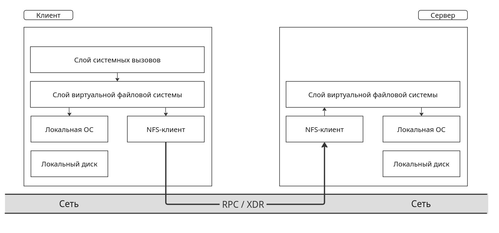

Продолжая разговор о распределениии компонентов РС, нельзя не упомянуть распределённые файловые системы (РФС). Их отличительной особенностью является распределение физических данных по узлам системы (возможно, с некоторой избыточностью) при поддержке их логической целостности. Для пользователей не должны быть заметны действия по перемещению данных в РС, их репликации. Также должна сохраняться видимость единой файловой системы, с которой они работают.

Основной задачей при разработке РФС является ***сетевая прозрачность*** - обеспечение тех же возможностей доступа к файлам, распределенным по
сети ЭВМ, которые обеспечиваются в системах разделения времени на централизованных ЭВМ. Кроме этого РФС должны обеспечивать ***высокую доступность*** данных. Ошибки систем или осуществление
операций копирования и сопровождения не должны приводить к недоступности файлов.

# Архитектура распределенных файловых систем

Поскольку РС состоит из независимых и, вообще говоря, гетерогенных узлов, РФС должна предоставлять клиентам некоторый общий интерфейс с файловой системой - ***файловый сервис***. При этом полной унификации этого сервиса неможет существовать, как минимум, из соображений неоднородности узлов. Как следствие, РФС должна иметь некоторый системный процесс, внутри которого осуществляется контроль РФС, и процесс, непосредственно реализующий файловый сервис(-ы) для конкретного клиента(-ов). Так РФС разбивается на два компонента - ***сервер директорий*** и ***файловый сервер***.

## Интерфейс файлового сервера

***Файловый сервер*** - это процесс, который реализует файловый сервис. \
Поскольку файловый сервер обычно является обычным пользовательским процессом, то в системе могут быть различные файловые серверы, предоставляющие различный сервис (например, `UNIX`-файл сервис и `MS-DOS`-файл сервис). Пользователь не должен знать, сколько файловых серверов имеется и где они расположены.

Файловый сервер отвечает за взаимодействие пользователя с файлами в РФС. Он обеспечивает **контроль доступа** к файлам, **контролирует совместный доступ**, **обеспечивает защиту данных** и их **восстановление** в случае сбоев и потерь.

### Особенности работы с файлами

Для любой файловой системы фундаментальным вопросом является определение файла. Во многих системах, таких как `UNIX` и `MS-DOS`, _файл_ - это не интерпретируемая последовательность байт. На многих централизованных ЭВМ (`IBM System/370`) файл представляется, как последовательность записей, которую можно специфицировать ее номером или содержимым некоторого поля (ключом). Но поскольку большинство распределенных систем базируются на использовании среды `UNIX` и `MS-DOS`,будем придерживаться первого понятия файла.

Файл может иметь **атрибуты** -  некоторую информацию, не являющуюся частью этого файла. Типичными атрибутами являются данные о владельце файла, размере файла, дате его создания и правах доступа. Ещё одним важным аспектом файловой модели является **модифицируемость** - возможность изменения файла после его создания. Обычно модифицируемость предусмотрена, однако существуют *системы с неизменяемыми файлами*. Такие файлы освобождают разработчиков от многих проблем при кэшировании и размножении.

Защита данных обеспечивается теми же механизмами, что и в однопроцессорных ЭВМ - мандатами и списками прав доступа. **Мандат** - своего рода билет, выданный пользователю для каждого файла с указанием прав доступа. Список прав доступа задает для каждого файла список пользователей с их правами. Простейшая схема с правами доступа - `UNIX`-схема, в которой различают три типа доступа (чтение, запись, выполнение), и три типа пользователей (владелец, члены его группы, и прочие).

Файловый сервис может базироваться на одной из двух моделей - модели **загрузки/разгрузки** и модели **удаленного доступа**. В первом случае файл передается между клиентом (памятью или дисками) и сервером целиком, а во втором файловый сервис обеспечивает множество операций (открытие, закрытие, чтение и запись части файла, сдвиг указателя, проверку и изменение атрибутов, и т.п.). Первый подход требует большого объема памяти у клиента, затрат на перемещение ненужных частей файла. При втором подходе файловая система функционирует на сервере, клиент может не иметь дисков и большого объема памяти.

## Интерфейс сервера директорий

Сервер директорий обеспечивает операции создания и удаления директорий, именования и переименования файлов, перемещение файлов из одной директории в другую. Здесь определяется алфавит и синтаксис имен. Для спецификации типа информации в файле используется часть имени (расширение) или явный атрибут.

Все распределенные системы являются **иерархическими**  - позволяют директориям содержать поддиректории. Некоторые системы также поддерживают создание ссылок и указателей на произвольные директории. При этом получающийся граф не обязан быть деревом, вследствие чего удаление некоторых связей может привести к появлению недостижимых компонент связности, обнаруживать которые в распределенных системах очень трудно.

### Особенности работы с директориями

Ключевое решение при конструировании распределенной файловой системы - решение о представлении иерархии директорий для процессов РС. В обязательном порядке должна поддерживаться **прозрачность именования** в РФС. Достигается она за счёт _прозрачности расположения_ (описания путей в РФС в виде единой структуры вне зависимости от реального расположения распределенных по системе данных) и _прозрачности миграции_ (перемещение данных в РФС не меняет их именования).

Существует три подхода к именованию в РФС:
 + Явное указание машины, хранящей некоторую часть РФС, и пути к файлам на этой машине;
 + Представление локальной части РФС в качестве основы и монтирование удаленных файловых систем в локальную иерархию файлов;
 + Единое пространство имен, которое выглядит одинаково на всех машинах.

Последний подход необходим для достижения видимости единого компьютера в  распределенной системе.

### Двухуровневое именование

Большинство систем используют схему **двухуровневого именования**. Файлы (и другие объекты) имеют символические имена для пользователей, но могут также иметь внутренние двоичные имена для использования самой системой. Например, в операции "открыть файл" пользователь задает символическое имя, а в ответ получает двоичное имя (в случае с `UNIX` - файловый дескриптор), которое и использует во всех других операциях с данным файлом.

Способы формирования двоичных имен различаются в разных системах:
 + Имя может указывать на сервер-хранилище и файл на нём;
 + В качестве двоичных имен при просмотре символьных имен возвращаются мандаты, содержащие помимо прав доступа либо физический номер машины с сервером, либо сетевой адрес сервера, а также номер файла.

В ответ на символьное имя некоторые системы могут возвращать несколько двоичных имен (для файла и его дублей), что позволяет повысить надежность работы с файлом.

# Семантика разделения файлов.

Ещё одна задача, возникающая при работе с РФС - реализация разделения и совместного доступа к данным. Существует несколько классических семантик, согласно которым этот процесс может быть реализован:
 + ***UNIX-семантика.*** \
   Это естественная семантика однопроцессорной ЭВМ, которую можно кратко описать так: "Если за операцией записи следует чтение, то результат определяется последней из предшествующих операций записи". \
   
   В распределенной системе такой семантики достичь легко только в том случае, когда имеется **один файл-сервер**, а клиенты **не имеют кэшей**. При наличии кэшей семантика будет нарушаться, и необходимо будет либо _все изменения в кэшах незамедлительно отражать в файлах_, либо _менять семантику разделения файлов_. \
   
   Еще одна возникающая проблема - **сохранение семантики общего указателя** файла (в `UNIX` он общий для открывшего файл процесса и его дочерних процессов), поскольку для процессов на разных ЭВМ контроль указателя будет затруднён.

 + ***Неизменяемые файлы*** \
   Очень радикальный подход к изменению семантики разделения файлов. Согласно ней в РФС будут доступны только две операции - **создание** и **чтение**. Разрешена замена новым файлом старого, таким образом организуется перемещение файлов в РФС. Если один процесс читает файл, а другой его подменяет, то в зависимости от реализации можно позволить первому процессу доработать со старым файлом, в то время как другие процессы могут уже работать с новым.

 + ***Семантика сессий*** \
   Согласно данной семантике изменения открытого файла видны только тому процессу (или машине), который производит эти изменения, и лишь после закрытия файла становятся видны другим процессам (или машинам). \
   
   Однако при такой семантике возникает проблема одновременной работы нескольких клиентов с одним файлом. В таком случае либо результат будет определяться процессом, последним закрывшим файл, либо можно только утверждать, что один из двух вариантов файла станет текущим.

 + ***Транзакции*** \
   Семантика работы транзакций подразумевает работу с данными в виде _некоторых неразрывных цепочек операций_ - **транзакций**. \
   
   Процесс выдает операцию «НАЧАЛО ТРАНЗАКЦИИ», сообщая тем самым, что последующие операции должны выполняться без вмешательства других процессов. Затем выдает последовательность чтений и записей, заканчивающуюся операцией «КОНЕЦ ТРАНЗАКЦИИ». \
   
   Если несколько транзакций стартуют в одно и то же время, то система гарантирует, что результат будет таким, каким бы он был в случае последовательного выполнения транзакций (в **неопределенном** порядке). Примером использования транзакций могут выступать банковские операции.

# Особенности реализации РФС

Выше были рассмотрены аспекты РФС, связанные с пользователем. Перейдём к рассмотрению реализационных аспектов.

## Общие особенности реализации

Естественно, основа разработки РФС должна исходить от реального использования данной системы. Исходя из статистики работы в местах применения РФС можно выявить особенности для конкретной реализации (использование / запрет кеширования, хранение данных на клиенте / на сервере, семантика разделения доступа).

Большинсто ключевых вопросов при реализации РФС связаны со ***структурой системы***.

Во-первых, это вопрос **различимости клиента и сервера в РС**. Имеются системы, где все машины имеют одно и то же ПО, и _любая_ машина может предоставлять файловый сервис. Бывают системы, в которых серверы являются обычными пользовательскими процессами и могут быть сконфигурированы для работы на одной машине с клиентами или на разных. Также встречаются системы, в которых клиенты и серверы являются _фундаментально разными машинами_ с точки зрения аппаратуры или ПО (требуют различных ОС, например).

Во-вторых, возникает вопрос **распределения компонент РФС**, в частности, разделения файловых серверов и серверов директорий. Разделение позволяет иметь разные серверы директорий(`UNIX`, `MS-DOS`) и один файловый сервер. Объединение позволяет сократить коммуникационные издержки. \
В случае разделения серверов и при наличии разных серверов директорий для различных поддеревьев возникает следующая проблема. Если первый вызванный сервер будет поочередно обращаться ко всем следующим, то возникают большие коммуникационные расходы. Если же первый сервер передает остаток имени второму, а тот третьему, и т.д., то это не позволяет использовать протоколы типа [`RPC`](https://habr.com/ru/articles/823049/). \
Возможным выходом может служить _использование кэша подсказок_. Однако в этом случае при получении от сервера директорий устаревшего двоичного имени клиент должен быть готов получить отказ от файлового сервера и повторно обращаться к серверу директорий (клиент может не быть конечным пользователем!).

В-третьих, при реализации РФС возникает вопрос **хранения информации о клиентах (текущем подключении/запросе или некоторой истории обращений) на серверах**. В связи с этим выделяют два вида серверов: **с состоянием** (`statefull`) и **без состояния** (`stateless`) \
Достоинствами серверов с состоянием являются **большая эффективность** и **большая возможность действия с файлами**. Это связано с тем, что серверы на основе сохранённой информации о ТОФ клиента, последних запросах могут производить упреждающие операции (упреждающее чтение, например), а также использовать более короткие системные команды. Также сохранение информации о клиенте позволяет записать в его владение данные, с которыми он работает, и, соответственно, захватывать доступ к файлам. \
Серверы без состояния обрабатывают обращения клиентов в виде единичных запросов, благодаря чему **не требуется дополнительная память** на созранение информации о клиенте, а также **нет ограничений** по количеству обрабатываемых данных. Кроме этого, данный способ **позволяет избежать ошибок при крахе клиента**.

## Кеширование

В системе c клиент-серверой архитектурой с памятью и дисками есть четыре потенциальных места для хранения файлов или их частей. \
Во-первых, **хранение файлов на дисках сервера**. При таком хранении не возникает проблемы консистентности, поскольку в системе существует только одна копия файла. Главная проблема такого способа - малая эффективность, поскольку для обмена с файлом требуется передача информации в обе стороны и обмен с диском. \
Во-вторых, **кэширование в памяти сервера**. Две основные проблемы реализации такого способа это решения, помещать в кэш файлы целиком или блоки диска и как осуществлять выталкивание из кэша. Коммуникационные издержки всё также остаются. \
Избавиться от коммуникаций позволяет кэширование в машине клиента. И третьим способом как раз выступает **кэширование на диске клиента**. Однако оно может не дать преимуществ перед кэшированием в памяти сервера, а сложность повышается значительно. Поэтому рассмотрим подробнее четвертый вариант - **кэширование в памяти клиента**. 

Существует три различных способа организации кеширования в памяти:
 + **Кеширование в каждом процессе**. Такой способ хорошо подходит в случаях, когда c файлом активно работает один процесс: многократно открывает и закрывает файл, читает и пишет, например в случае процесса базы данных.
 + **Кеширование в ядре**. Такой способ позволяет обращаться к кешу всем процессам клиента, однако подразумевает накладные расходы на обращение к ядру.
 + **Кеш-менеджер в виде отдельного процесса**. При такой реализации ядро освобождается от функций файловой системы, однако на пользовательском уровне становится трудно эффективно использовать память, особенно в случае виртуальной памяти. Возможна фиксация страниц, чтобы избежать обменов с диском.

Оценить выбор того или иного способа можно только при учете характера приложений и данных о быстродействии процессоров, памятей, дисков и сети.

### Консистентность кешей

Кэширование в клиенте создает серьезную проблему - сложность поддержания кэшей в согласованном состоянии. При этом классические алгоритмы мультипроцессорных ЭВМ в большинстве случаев требуют, как минимум, доработок для корректной работы в распределённой системе.
 + ***Алгоритм со сквозной записью***. Данный алгоритм, при котором модифицируемые данные пишутся в кэш и сразу же посылаются серверу, не является решением проблемы. При его использовании в мультипроцессорах все кэши “подслушивали” шину, через которую осуществляются все “сквозные” записи в память, и сразу же обновляли находящиеся в них данные. В РС такое “подслушивание” невозможно, из-за чего смысл кеша пропадает, поскольку  перед каждым использованием данных из кэша требуется проверять, не устарела ли информация. Кроме этого, постоянная запись вызывает коммуникационные расходы.
 + ***Алгоритм с отложенной записью***. Через регулярные промежутки времени все модифицированные блоки пишутся в файл (так на традиционных ЭВМ работает ОС `UNIX`). Эффективность такого алгоритма выше, однако семантика непонятна пользователю, а также требует разрешения конфликтов при изменении одних и тех же данных разными клиентами.
 + ***Алгоритм записи в файл при закрытии файла***. Данный алгоритм реализует семантику сессий. Такой алгоритм, на первый взгляд, кажется очень неудачным для ситуаций, когда несколько процессов одновременно открыли один файл и модифицировали его. Однако, аналогичная картина происходит и на традиционной ЭВМ, когда два процесса на одной ЭВМ открывают файл, читают его, модифицируют в своей памяти и пишут назад в файл. 
 + ***Алгоритм централизованного управления***. Данный алгоритм позволит выдержать семантику `UNIX`, однако неэффективен, ненадежен, и плохо масштабируется.

## Размножение данных

РС может предоставлять такой сервис, как поддержание для указанных файлов нескольких копий на различных серверах. Цели такого сервиса - **повысить надежность и доступность данных** (крах одного сервера не вызывает недоступность размноженныхфайлов), а также **распределить нагрузку** на несколько серверов.

Существует три схемы реализации размножения:
 + ***Явное размножение*** (непрозрачно). В ответ на открытие файла пользователю выдаются несколько двоичных имен, которые он должен использовать для явного дублирования операций с файлами.
 + ***«Ленивое» размножение***. Сначала копия создается на одном сервере, а затем он сам автоматически (в свободное время) создает дополнительные копии и обеспечивает их поддержание.
 + **Симметричное размножение**. Все операции одновременно вызываются в нескольких серверах и одновременно выполняются.

Для поддержания актуальности копий РФС должна иметь **протоколы коррекции данных**. Просто посылка сообщений с операцией коррекции каждой копии является не очень хорошим решением, поскольку в случае аварий некоторые копии могут остаться нескорректированными. Существует несколько алгоритмов, которые решают эту проблему:
 + ***Метод размножения главной копии***. Один сервер объявляется главным, а остальные - подчиненными. Все изменения файла посылаются главному серверу. Он сначала корректирует свою локальную копию, а затем рассылает подчиненным серверам указания о коррекции. Чтение файла может выполнять любой сервер. Для защиты от рассогласования копий в случае краха главного сервера до завершения им рассылки всех указаний о коррекции, главный сервер до выполнения коррекции своей копии запоминает в стабильной памяти задание на коррекцию. Слабостью данного метода является невозможность выполнения коррекции данных при выходе из строя главного сервера
 + ***Метод одновременной коррекции всех копий***. Все изменения файла посылаются (используя надежные и неделимые широковещательные рассылки) всем серверам. Чтение файла может выполнять любой сервер.
 + ***Метод голосования***. Идея данного метода - запрашивать чтение и запись файла у многих серверов (запись - **строго у всех**!). Для успешного выполнения записи требуется, чтобы  $N_w$ серверов ее выполнили. При этом у всех этих серверов должно быть согласие относительно номера текущей версии файла. Этот номер увеличивается на единицу с каждой коррекцией файла. Для выполнения чтения достаточно обратиться к $N_r$ серверам и воспользоваться одним из тех, кто имеет последнюю версию файла. Значения для кворума чтения ($N_r$) и кворума записи ($N_w$) должны удовлетворять соотношению $N_r + N_w > N$. Поскольку чтение является более частой операцией, то естественно взять $N_r = 1$. Однако в этом случае для кворума записи потребуются все серверы.

# `Sun Microsystem’s Network File System (NFS)`

В качестве примера рассмотрим одну из популярных РФС `NFS`, изначально реализованную компанией `Sun Microsystem` в 1985 году для использования на своих рабочих станций на базе `UNIX`. В настоящее время поддерживается также другими фирмами для `UNIX` и других ОС (включая `MS-DOS`). 

## Архитектура `NFS`.

`NFS` позволяет иметь произвольное множество клиентов и серверов на произвольных ЭВМ локальной или широкомасштабной сети. Каждый сервер экспортирует некоторое число своих директорий для доступа к ним удаленных клиентов. При этом экспортируются директории со всеми своими поддиректориями, т.е., фактически, поддеревья. Список экспортируемых директорий хранится в специальном файле, что позволяет при загрузке сервера автоматически их экспортировать. Клиент получает доступ к экспортированным директориям путем их монтирования. Если клиент не имеет дисков, то может монтировать директории в свою корневую директорию. Если несколько клиентов одновременно смонтировали одну и ту же директорию, то они могут разделять файлы в общей директории без каких либо дополнительных усилий. Простота -достоинство `NFS`.

## Протоколы `NFS`.

Поскольку одна из целей `NFS` - **поддержка гетерогенных систем**, клиенты и серверы могут работать на разных ЭВМ с различной архитектурой и различными ОС. Поэтому необходимоиметь строгие протоколы их взаимодействия. `NFS` имеет два таких протокола.

Первый протокол поддерживает **монтирование**. Клиент может послать серверу составное имя директории (имя пути) и попросить разрешения на ее монтирование. Куда будет монтироваться директория, для сервера значения не имеет, поэтому эта информация не сообщается ему. Если путь задан корректно и директория экспортируема, то сервер возвращает клиенту дескриптор директории. Дескриптор содержит поля, уникально идентифицирующие тип ЭВМ, диск, номер `i-node` (понятие ОС `UNIX`) для данной директории, а также информацию о правах доступа к ней. Этот дескриптор используется клиентом в последующих операциях с директорией.

Многие клиенты монтируют требуемые удаленные директории автоматически при запуске, используя командную процедуру `shell`-интерпретатора ОС `UNIX`. Версия ОС `UNIX`, разработанная `Sun` (`Solaris`), имеет свой специальный режим автоматического монтирования. С каждой локальной директорией можно связать множество удаленных директорий. Когда открывается файл, отсутствующий в локальной директории, ОС посылает запросы всем серверам, владеющим указанными директориями. Кто ответит первым, директория того и будет смонтирована. Такой подход обеспечивает и надежность, и эффективность (кто свободнее, тот раньше и ответит). При этом подразумевается, что все альтернативные директории идентичны. Поскольку `NFS` не поддерживает размножение файлов или директорий, то такой режим автоматического монтирования в основном используется для директорий с кодами программ или других редко изменяемых файлов.

Второй протокол - для **доступа к директориям и файлам**. Клиенты посылают сообщения, чтобы манипулировать директориями, читать и писать файлы. Можно получить атрибуты файла. Поддерживается большинство системных вызовов ОС `UNIX`, **исключая** `open` и `close`. Для получения дескриптора файла по его символическому имени используется операция `lookup`, отличающаяся от открытия файла тем, что никаких внутренних таблиц не создается. Таким образом, серверы в `NFS` **не имеют состояния** (`stateless`). Поэтому для захвата файла используется специальный механизм.

`NFS` использует механизм защиты `UNIX`. В первых версиях все запросы содержали идентификатор пользователя и его группы (для проверки прав доступа). Несколько лет эксплуатации системы показали слабость такого подхода. Теперь используется криптографический механизм с открытыми ключами для проверки законности каждого запроса и ответа. Данные не шифруются.

Все ключи, используемые для контроля доступа, поддерживаются специальным сервисом (и серверами) - **сетевым информационным сервисом** (`NIS`). Храня пары "ключ-значение", сервис обеспечивает выдачу значения кода при правильном подтверждении ключей. Кроме того, он обеспечивает отображение имен машин на их сетевые адреса, и другие отображения. `NIS`-серверы используют схему "главный-подчиненные" для реализации размножения («ленивое» размножение).

## Реализация `NFS`

	(`XDR - External Data Represantation`)

Задача уровня виртуальной файловой системы - поддерживать для каждого открытого файла строку в таблице (`v-node`), аналогичную `i-node` `UNIX`. Эта строка позволяет различать локальные файлы от удаленных. Для удаленных файлов вся необходимая информация хранится в специальной `r-node` в `NFS`-клиенте, на которую ссылается `v-node`. У сервера **нет никаких таблиц**. 

Передачи информации между клиентом и сервером `NFS` производятся блоками размером `8Кb` (для эффективности).

Два кэша - кэш данных и кэш атрибутов файлов (обращения к ним очень часты, разработчики `NFS` исходили из оценки 90%). Реализована семантика отложенной записи - предмет критики `NFS`. Имеется также кэш подсказок для ускорения получения `v-node` по символическому имени. При использовании устаревшей подсказки `NFS`-клиент будет обращаться к `NFS`-серверу и корректировать свой кэш (пользователь об этом ничего не должен знать).

