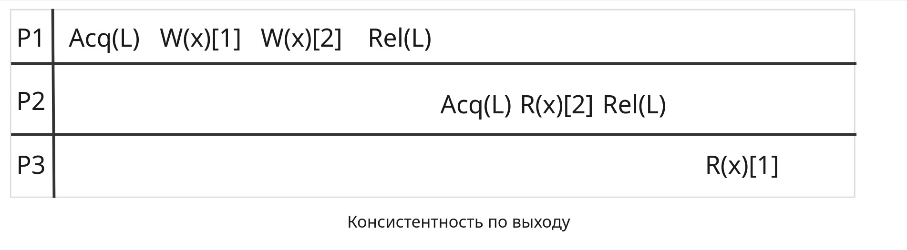

Рассмотрев в прошлой главе РФС, как некоторую физическую кластеризацию данных, обратимся к ***распределенной общей памяти*** (РОП, `DSM`), объединяющей все хранимые в РС данные в единое логическое пространство. 

Традиционно распределенные вычисления базируются на модели передачи сообщений, в которой данные передаются от процессора к процессору в виде сообщений. Удаленный вызов процедур (`RPC`) фактически является той же самой моделью (или очень близкой).

`DSM`, `Distributed Shared Memory` - виртуальное адресное пространство, разделяемое всеми узлами (процессорами) распределенной системы. Программы получают доступ к данным в `DSM` примерно так же, как это происходит при реализации виртуальной памяти традиционных ЭВМ. В системах с `DSM` данные могут перемещаться между локальными памятями разных компьютеров аналогично тому, как они перемещаются между оперативной и внешней памятью одного компьютера.

# Достоинства `DSM`

1. В модели передачи сообщений программист обеспечивает доступ к разделяемым данным посредством явных операций посылки и приема сообщений. При этом приходится квантовать алгоритм, обеспечивать своевременную смену информации в буферах, преобразовывать индексы массивов. Все это сильно усложняет программирование и отладку. `DSM` **скрывает** от программиста **пересылку данных** и обеспечивает ему **абстракцию разделяемой памяти**, к использованию которой он уже привык на мультипроцессорах. Программирование и отладка с использованием `DSM` гораздо проще.
2. В модели передачи сообщений данные перемещаются между двумя различными адресными пространствами. Это делает очень трудным передачу сложных структур данных между процессами. Например, передача данных по ссылке и передача структур данных, содержащих указатели, вызывает серьезные проблемы. В системах с `DSM` этих проблем нет, что несомненно **упрощает разработку распределенных приложений**.
3. Объем суммарной физической памяти всех узлов может быть огромным. Эта огромная память становится **доступна приложению без издержек**, связанных в традиционных системах с дисковыми обменами. Это достоинство становится все весомее в связи с тем, что скорости процессоров и коммуникаций растут быстрее скоростей памяти и дисков.
4. `DSM`-системы могут наращиваться практически беспредельно в отличие от систем с разделяемой памятью, т.е. **являются масштабируемыми**.
5. Программы, написанные для мультипроцессоров с общей памятью, могут в принципе **без каких-либо изменений выполняться на `DSM`-системах** (по крайней мере, они могут быть легко перенесены на `DSM`-системы). 

По существу, `DSM`-системы **преодолевают архитектурные ограничения мультипроцессоров** и сокращают усилия, необходимые для написания программ для распределенных систем. Обычно они реализуются программно-аппаратными средствами, но в 90-х годах появилось несколько коммерческих `MPP` с `DSM`, реализованной аппаратно (`Convex SPP`, `KSR1`, `Origin` 2000). В конце 2004 года второй в списке `TOP-500` являлась система, состоящая из 20 `DSM`-кластеров `SGI ALTIX3000`, каждый по 512 процессоров.

# Алгоритмы реализации `DSM`.

При реализации `DSM` центральными вопросами являются:
 + Как поддерживать информацию о расположении удаленных данных?
 + Как снизить при доступе к удаленным данным коммуникационные задержки и большие накладные расходы, связанные с выполнением коммуникационных протоколов?
 + Как сделать разделяемые данные доступными одновременно на нескольких узлах для того, чтобы повысить производительность системы?

Рассмотрим четыре возможных алгоритма реализации `DSM`

## Алгоритм с центральным сервером

Все разделяемые данные поддерживает центральный сервер. Он возвращает данные клиентам по их запросам на чтение, по запросам на запись он корректирует данные и посылает клиентам в ответ квитанции. Клиенты при отсутствии ответа сервера за определённый период (тайм-аут) совершают повторные запросы. Дубликаты запросов на запись могут распознаваться путем нумерации запросов. Если несколько повторных обращений к серверу остались без ответа, приложение получит отрицательный код ответа (это обеспечит клиент).

Алгоритм прост в реализации, но сервер в такой системе будет узким местом работы РС. Простым решением в таком случае будет разделяемые данные распределить между несколькими серверами. В таком случае клиент должен уметь определять, к какому серверу надо обращаться при каждом доступе к разделяемой переменной. Например, распределение между серверами данных может быть осуществлено в зависимости от их адресов, и для определения нужного сервера будет использоваться специальная функция отображения. 

Однако независимо от числа серверов, работа с памятью в таком случае будет требовать коммуникаций и катастрофически замедлится.

## Миграционный алгоритм

В отличие от предыдущего алгоритма, когда запрос к данным направлялся в место их расположения, в этом алгоритме меняется расположение данных - они **перемещаются в то место, где потребовались**. Это позволяет последовательные обращения к данным осуществлять локально. Миграционный алгоритм позволяет в любой момент времени обращаться к одному элементу данных **только одному узлу**. 

Обычно мигрируют целиком страницы или блоки данных, а не запрашиваемые единицы данных. Это позволяет воспользоваться присущей приложениям локальностью доступа к данным для снижения стоимости миграции. Однако такой подход приводит к **трэшингу**, когда страницы очень часто мигрируют между узлами при малом количестве обслуживаемых запросов. Причиной этого может быть так называемое _"ложное разделение"_, когда разным процессорам нужны разные данные, но эти данные расположены в одном блоке или странице. Некоторые системы позволяют задать время, в течение которого страница насильно удерживается в узле для того, чтобы успеть выполнить несколько обращений к ней до ее миграции в другой узел.

Миграционный алгоритм позволяет интегрировать в систему `DSM` с виртуальной памятью, обеспечивающейся операционной системой в отдельных узлах. Если размер страницы `DSM` совпадает с размером страницы виртуальной памяти (или кратен ей), то можно обращаться к разделяемой памяти обычными машинными командами, воспользовавшись аппаратными средствами проверки наличия в оперативной памяти требуемой страницы и замены виртуального адреса на физический. Конечно, для этого виртуальное адресное пространство процессоров должно быть достаточно, чтобы адресовать всю разделяемую память. При этом, несколько процессов в одном узле могут разделять одну и ту же страницу.

Для определения места расположения блоков данных миграционный алгоритм может использовать сервер, отслеживающий перемещения блоков, либо воспользоваться механизмом подсказок в каждом узле. Возможна и широковещательная рассылка запросов.

## Алгоритм размножения для чтения

Предыдущий алгоритм позволял обращаться к разделяемым данным в любой момент времени только процессам в одном узле (в котором эти данные находятся). Данный алгоритм расширяет миграционный алгоритм **механизмом размножения блоков данных**, позволяя либо _многим_ узлам иметь возможность _одновременного доступа по чтению_, либо _одному_ узлу иметь _возможность читать и писать данные_ (**протокол многих читателей и одного писателя**).

При использовании такого алгоритма требуется отслеживать расположение всех блоков данных и их копий. Например, каждый собственник блока может отслеживать расположение его копий. Безусловно, производительность повышается за счет возможности одновременного доступа по чтению, но запись требует серьезных затрат для уничтожения всех устаревших копий блока данных или их коррекции. Да и модель многих читателей и одного писателя мало подходит для параллельных программ.

## Алгоритм размножения для чтения и записи

Этот алгоритм является расширением предыдущего алгоритма. Он позволяет многим узлам иметь одновременный доступ к разделяемым данным _на чтение и запись_ (**протокол многих читателей имногих писателей**). 

Поскольку много узлов могут писать данные параллельно, требуется для поддержания согласованности данных контролировать доступ к ним. Одним из способов обеспечения согласованности данных является использование специального процесса для упорядочивания модификаций памяти. Все узлы, желающие модифицировать разделяемые данные должны посылать свои модификации этому процессу. Он будет присваивать каждой модификации очередной номер и рассылать его широковещательно вместе с модификацией всем узлам, имеющим копию модифицируемого блока данных. Каждый узел будет осуществлять модификации в порядке возрастания их номеров. Разрыв в номерах полученных модификаций будет означать потерю одной или нескольких модификаций. В этом случае узел может запросить недостающие модификации.

Данный алгоритм может существенно снизить среднюю стоимость доступа к данным только тогда, когда количество чтений значительно превышает количество записей. В общем случае, все перечисленные выше алгоритмы являются слишком неэффективными, чтобы их можно было использовать для преодоления архитектурных ограничений мультипроцессоров и сокращения усилий, необходимых для написания программ для распределенных систем. 

Добиться эффективности можно только изменив семантику обращений к памяти. Для упрощения понимания основных идей алгоритмов реализации `DSM` мы в дальнейшем будем исходить из того, что **все работает надежно** (например, все сообщения доходят до адресатов) и **никаких мер для обеспечения надежности предпринимать не нужно**.

# Модели констистентности памяти

Напомним, что ***консистентность данных*** - это свойство данных, при котором они соответствуют друг другу, не противоречат друг другу и поддерживаются в актуальном состоянии. Для поддержания консистентности памяти существует несколько моделей.

**Модель консистентности** представляет собой некоторый договор между программами и памятью, в котором указывается, что при соблюдении программами определенных правил работы с памятью будет обеспечена определенная семантика операций чтения/записи. Если же эти правила будут нарушены, то память не гарантирует правильность выполнения операций чтения/записи. Рассмотрим основные модели консистентности, используемые в системах с распределенной памятью. 

Все модели будут сопровождаться схемами работы с обозначениями операций чтения и записи, совершаемыми разными процессами РС. Обозначения операций состоят из трёх блоков: `<Операция чтения(R)/записи(W)>(<указание имени переменной, над которой проводится операция>)[<результат операции>]`. Например, обозначение `W(x)[1]` означает запись **в** ячейку памяти переменной `x` значения `1`, `R(y)[0]` - чтение **из** ячейки памяти переменной `y` c получением значения `0`. 

## Строгая консистентность

Данная модель консистентности удовлетворяет условию: **«Операция чтения ячейки памяти с адресом `X` должна возвращать значение, записанное самой последней операцией записи по адресу `X`»**. Указанное выше условие кажется довольно естественным и очевидным, однако оно предполагает наличие в системе понятия **абсолютного времени** для определения «наиболее последней операции записи».

Все однопроцессорные системы обеспечивают строгую консистентность, но в распределенных многопроцессорных системах ситуация намного сложнее. Предположим, что переменная `X` расположена в памяти машины `B`, и процесс, который выполняется на машине `A`, пытается прочитать значение этой переменной в момент времени $T_1$. Для этого машине `B` посылается запрос переменной `X`. Немного позже, в момент времени $T_2$, процесс, выполняющийся на машине `B`, производит операцию записи нового значения в переменную `X`. Для обеспечения строгой консистентности операция чтения должна возвратить в машину `А` старое значение переменной вне зависимости от того, где расположена машина A и насколько близки между собой два момента времени $T_1$ и $T_2$. Однако, если $T_1-T_2$ равно 1 нсек, и машины расположены друг от друга на расстоянии 3-х метров, то сигнал о запросе значения переменной должен быть передан на машину `B` со скоростью, в 10 раз превышающей скорость света, что невозможно.


## Последовательная консистентность
 
Строгая консистентность представляет собой идеальную модель для программирования, но ее, к сожалению программистов, невозможно реализовать для распределенных систем. Однако практический опыт показывает, что в некоторых случаях можно обходиться и более «слабыми» моделями. Все эти методы опираются на то, что должна соблюдаться **последовательность определенных событий** записи и чтения.

Последовательную консистентность впервые определил `Lamport` в 1979 г. По его определению, модель последовательной консистентности памяти должна удовлетворять следующему условию: **«Результат выполнения должен быть тот же, как если бы операторы всех процессоров выполнялись бы в некоторой последовательности, в которой операторы каждого индивидуального процессора расположены в порядке, определяемом программой этого процессора»**

Последовательная консистентность не гарантирует, что операция чтения возвратит значение, записанное другим процессом нано секундой или даже минутой раньше, в этой модели только точно гарантируется, что **все процессы должны «видеть» одну и ту же последовательность записей в память**. Результат повторного выполнения параллельной программы в системе с последовательной консистентностью (как, впрочем, и при строгой консистентности) может **не совпадать** с результатом предыдущего выполнения этой же программы, если в программе нет регулирования операций доступа к памяти с помощью механизмов синхронизации.


Описанный ранее миграционный алгоритм реализует последовательную консистентность.

Последовательная консистентность может быть реализована более эффективно следующим образом. Страницы, доступные на запись, размножаются, но операции чтения из разделяемой памяти _не должны начинаться_ на каждом процессоре _до тех пор_, пока _не завершится выполнение предыдущей операции записи_, выданной этим процессором, т.е. будут скорректированы все копии соответствующей страницы. Для модификации страниц при этом могут использоваться два алгоритма.

***Централизованный алгоритм*** \
Процесс посылает координатору запрос на модификацию переменной и ждет от него указания о проведении этой модификации. Такое указание координатор рассылает сразу всем владельцам копий этой переменной. Каждый процесс выполняет эти указания по мере их получения. Поскольку сообщения от координатора приходят каждому процессу в том порядке, в котором они были им посланы, то все процессы корректируют свои копии переменных в этом едином порядке. 

***Децентрализованный алгоритм*** \
Процесс посылает посредством механизма упорядоченного широковещания (неделимые широковещательные рассылки) указание о модификации переменной всем владельцам копий соответствующей страницы (включая и себя) и ждет получения этого своего собственного указания.

## Причинная консистентность

Причинная модель консистентности памяти представляет собой более «слабую» модель по сравнению с последовательной моделью, поскольку в ней не всегда требуется, чтобы все процессы «видели» одну и ту же последовательность записей в память. Её отличительной особенностьюявляется разделение всех операций записи на **потенциально зависимые** и **независимые**.

Рассмотрим пример. Предположим, что процесс `P1` модифицировал переменную `x`, затем процесс `P2` прочитал `x` и модифицировал `y`. В этом случае модификация `x` и модификация `y` _потенциально причинно зависимы_, так как новое значение `y` могло зависеть от прочитанного значения переменной `x`. С другой стороны, если два процесса одновременно изменяют значения одной и той же или различных переменных, то между этими событиями _нет причинной связи_. Операции записи, которые причинно не зависят друг от друга, называются **параллельными**.

Таким образом, причинная модель консистентности памяти определяется следующим условием: **«Последовательность операций записи, которые потенциально причинно зависимы, должна наблюдаться всеми процессами системы одинаково, параллельные операции записи могут наблюдаться разными узлами в разном порядке»**.


При реализации причинной консистентности в случае размножения страниц выполнение записи в общую память требует ожидания выполнения **только тех предыдущих операций записи**, от которых эта запись **потенциально причинно зависит**. Параллельные операции записи **не задерживают выполнение друг друга** (и не требуют неделимости широковещательных рассылок всем владельцам копий страницы).

Реализация причинной консистентности может осуществляться следующим образом:
 + Все модификации переменных на каждом процессоре нумеруются;
 + Всем процессорам вместе со значением модифицируемой переменной рассылается номер этой модификации на данном процессоре, а также номера модификаций всех процессоров, известных данному процессору к этому моменту;
 + Выполнение любой модификации на каждом процессоре задерживается до тех пор, пока он не получит и не выполнит все те модификации других процессоров, о которых было известно процессору - автору задерживаемой модификации.

## `PRAM` консистентность

`PRAM` (`Pipelined RAM`) консистентность определяется следующим образом: **«Операции записи, выполняемые одним процессором, видны всем остальным процессорам в том порядке, в каком они выполнялись, но операции записи, выполняемые разными процессорами, могут быть видны в произвольном порядке»**.


Преимущество модели `PRAM` консистентности заключается в простоте ее реализации, поскольку операции записи на одном процессоре могут быть _конвейеризованы_: можно продолжать выполнение процесса и выполнять другие операции с общей памятью, не дожидаясь завершения предыдущих операций записи (модификации всех копий страниц, например), необходимо только быть уверенным, что все процессоры увидят эти записи в одном и том же порядке.

`PRAM` консистентность может приводить к результатам, противоречащим интуитивному представлению. Например, в привденном ниже примере оба процесса могут быть убиты, что невозможно при последовательной консистентности:

`P1`
```c
a = 1;

if (b == 0) {
	kill(P2);
}
```

`P2`
```c
b = 1;

if (b == 0) {
	kill(P1);
}
```

## Процессорная консистентность

Модель процессорной консистентности отличается от модели `PRAM` консистентности тем, что в ней дополнительно требуется **когерентность памяти**: **«Для каждой переменной `x` есть общее согласие относительно порядка, в котором процессоры модифицируют эту переменную, операции записи в разные переменные - параллельны»**. 

Таким образом, к упорядочиванию записей каждого процессора добавляется упорядочивание записей в переменные или группы переменных (например, находящихся в независимых блоках памяти).

Для реализации процессорной консистентности используется **децентрализованный алгоритм**. За каждую группу переменных отвечает свой координатор, который получает от процессов запросы на модификацию и рассылает всем указания о проведении модификации. Чтобы не нарушить порядок получения процессами указаний о модификациях различных переменных, запрошенных одним процессом у разных координаторов, каждый процесс нумерует свои модификации, и эти номера рассылаются вместе с указаниями о проведении модификаций. В таком случае любой процесс, получающий указание о проведении модификации, может задержать его выполнение до получения недостающих указаний о предшествующих модификациях соответствующего процесса.

## Слабая консистентность

Модель `PRAM` консистентности производительнее и эффективнее моделей с более строгой консистентностью, но и ее ограничения для многих приложений не всегда являются необходимыми, поскольку требуют получение всеми процессорами информации о каждой операции записи, выполняемой на некотором процессоре. 

Рассмотрим, для примера, процесс, который в критической секции циклически читает и записывает значение некоторых переменных. Даже, если остальные процессоры и не пытаются обращаться к этим переменным до выхода первого процесса из критической секции, для удовлетворения требований описанных выше моделей консистентности они должны «видеть» все записи первого процессора в порядке их выполнения, что, естественно, совершенно не нужно. Наилучшее решение в такой ситуации - это позволить первому процессу завершить выполнение критической секции и, только после этого, переслать остальным процессам значения модифицированных переменных, не заботясь о пересылке промежуточных результатов и порядке их вычисления внутри критической секции.

Предложенная в 1986 г. (`Dubois et al.`) модель **слабой консистентности**, основана на выделении среди переменных специальных **синхронизационных переменных** (доступ к которым производится специальной операцией синхронизации памяти) и описывается следующими правилами:
1. Доступ к **синхронизационным переменным** определяется моделью **последовательной консистентности**;
2. Доступ к синхронизационным переменным запрещен (задерживается), пока не выполнены все предыдущие операции записи;
3. Доступ к данным (запись, чтение) запрещен, пока не выполнены все предыдущие обращения к синхронизационным переменным.

Первое правило определяет, что все процессы «видят» обращения к синхронизационным переменным в определенном (одном и том же) порядке (а “видеть” они могут только посредством чтения обычных переменных!).

Второе правило гарантирует, что выполнение процессором операции обращения к синхронизационной переменной возможно только после полного завершения выполнения всех предыдущих операций записи переменных, выданных данным процессором. При этом, все выполненные процессом записи станут гарантированно видны остальным процессам **только после выполнения ими синхронизации**.

Третье правило определяет, что при обращении к обычным (не синхронизационным) переменным на чтение или запись, все предыдущие обращения к синхронизационным переменным должны быть выполнены полностью. Выполнив синхронизацию памяти (эта операция в примере ниже обозначена буквой `S`) перед обращением к общей переменной, процесс может быть уверен, что получит правильное значение этой переменной (то, которое записал какой-то процесс, успевший сообщить об этом всем посредством синхронизации памяти).


## Консистентность по выходу

В системе со слабой консистентностью возникает проблема при обращении к синхронизационной переменной: система не имеет информации о **цели** этого обращения - или процесс _завершил модификацию общей переменной_, или _готовится прочитать значение общей переменной_. Для более эффективной реализации модели консистентности система должна различать две ситуации: вход в критическую секцию и выход из нее.

В модели **консистентности по выходу** введены специальные функции обращения к синхронизационным переменным:
 + `ACQUIRE` - захват синхронизационной переменной, информирует систему о входе в критическую секцию;
 + `RELEASE` - освобождение синхронизационной переменной, определяет завершение критической секции.

Захват и освобождение используются для организации доступа не ко всем общим переменным, а только к тем, которые защищаются данной синхронизационной переменной. Такие общие переменные называют **защищенными переменными**.

Следующие правила определяют требования к модели консистентности по выходу:
1. До выполнения обращения к общей переменной, должны быть полностью выполнены все предыдущие захваты синхронизационных переменных данным процессором.
2. Перед освобождением синхронизационной переменной должны быть закончены все операции чтения/записи, выполнявшиеся процессором прежде.
3. Реализация операций захвата и освобождения синхронизационной переменной должна удовлетворять требованиям **процессорной консистентности** (последовательная консистентность не требуется, захваты разных переменных осуществляются параллельно).

При выполнении всех этих требований и использовании методов захвата и освобождения результат выполнения программы будет таким же, как при выполнении этой программы в системе **с последовательной моделью консистентности**.



Существует модификация консистентности по выходу - **«ленивая»**. В отличие от описанной («энергичной») консистентности по выходу, она не требует выталкивания всех модифицированных данных при выходе из критической секции. Вместо этого, при запросе входа в критическую секцию процессу передаются текущие значения защищенных разделяемых переменных (например, от процесса, который последним находился в критической секции, охраняемой этой синхронизационной переменной). При повторных входах в критическую секцию того же самого процесса не требуется никаких обменов сообщениями. Для того, чтобы узнать, какие переменные защищаются конкретной синхронизационной переменной, нужно фиксировать все переменные, изменяемые внутри соответствующих критических секций.

## Консистентность по входу

Эта консистентность представляет собой еще один пример модели консистентности, которая ориентирована на использование критических секций. Так же, как и в предыдущей модели, эта модель консистентности требует от программистов (или компиляторов) использование механизма захвата/освобождения для выполнения критических секций. Однако в этой модели требуется,чтобы **каждая общая переменная была явно связана с некоторой синхронизационной переменной** (или с несколькими синхронизационными переменными). При этом если доступ к элементам массива или различным отдельным переменным может производиться **независимо** (параллельно), то эти элементы массива (общие переменные) должны быть связаны **с разными синхронизационными переменными**. Таким образом, вводится явная связь между синхронизационными переменными и общими переменными, которые они охраняют.

Критические секции, охраняемые одной синхронизационной переменной, могут быть двух типов:
 + Секция **с монопольным доступом** (для модификации переменных);
 + Секция **с немонопольным доступом** (для чтения переменных).

Рассмотрим использование синхронизационных переменных. Каждая синхронизационная переменная имеет _временного владельца_. Им выступает последний процесс, захвативший доступ к этой переменной. Этот владелец может в цикле выполнять критическую секцию, **не посылая** при этом сообщений другим процессорам. Процесс, который в данный момент не является владельцем синхронизационной переменной, но требующий ее захвата, должен послать запрос текущему владельцу этой переменной для получения права собственности на синхронизационную переменную и значений охраняемых ею общих переменных. Разрешена ситуация, когда синхронизационная переменная имеет несколько владельцев, но только в том случае, если связанные с этой переменной общие данные используются **только для чтения**.

Формальные правила, определяющие модель консистентности по входу:
1. Процесс не может захватить синхронизационную переменную до того, пока не обновлены все переменные этого процесса, охраняемые захватываемой синхронизационной переменной;
2. Процесс не может захватить синхронизационную переменную в монопольном режиме (для модификации охраняемых данных), пока другой процесс, владеющий этой переменной (даже в немонопольном режиме), не освободит ее;
3. Если какой-то процесс захватил синхронизационную переменную в монопольном режиме, то ни один процесс не сможет ее захватить даже в немонопольном режиме до тех пор, пока первый процесс не освободит эту переменную, и не будут обновлены текущие значения охраняемых переменных в процессе, запрашивающем синхронизационную переменную.

## Таблица сравнения видов консистентности

| Модели консистентности           | Тип консистентности | Описание                                                                                            |
| -------------------------------- | ------------------- | --------------------------------------------------------------------------------------------------- |
| ***Без операций синхронизации*** | Строгая             | Упорядочение всех доступов к разделяемым данным по абсолютному времени.                             |
|                                  | Последовательная    | Все процессы видят все записи разделяемых данных в одном и том же порядке.                          |
|                                  | Причинная           | Все процессы видят все причинно-связанные записи данных в одном и том же порядке.                   |
|                                  | Процессорная        | `PRAM`-консистентность + когерентность памяти.                                                      |
|                                  | `PRAM`              | Все процессоры видят записи любого процессора в одном и том же порядке.                             |
| ***С операциями синхронизации*** | Слабая              | Разделяемые данные можно считать консистентными только после выполнения синхронизации.              |
|                                  | По выходу           | Разделяемые данные, изменяемые в критической секции, становятся консистентными после выхода из нее. |
|                                  | По входу            | Разделяемые данные, связанные с критической секцией, становятся консистентными при входе в нее.     |

# Конструкторские решения в реализации `DSM`

## Страничная `DSM`

Общая память разбивается на порции одинакового размера - **страницы** или **блоки**. Если выбрать размер совпадающим или кратным длине страницы оперативной памяти процессоров (если их память страничная), можно будет воспользоваться механизмом защиты памяти для обнаружения отсутствующих страниц `DSM` и аппаратным механизмом замены виртуального адреса на физический. К этому же типу `DSM` (не знающих заранее ничего о содержимом памяти) можно отнести и аппаратные реализации **на базе кэшей** (`Convex SPP`).

## `DSM` на базе разделяемых переменных.

В **`DSM` с разделяемыми переменными** отдельные структуры данных разделяются между процессорами. Программист должен точно определить, какие переменные в программе должны разделяться, а какие не должны.Знание информации о режиме использования разделяемых переменных позволяет воспользоваться более эффективными протоколами когерентности.

Рассмотрим следующую программу, которая автоматически распараллеливается посредством размножения всех переменных на все процессоры и распределения между ними витков цикла.

```c
s = 0; 
last_A = 0;

for (i = 1; i < L2-1; i++) { 
	r = A[i-1] * A[i+1];
	C[i] = r; 
	s = s + r*r;
	
	if (A[i] != 0) { 
		last_A = A[i]; 
	} 
}

A[0] = last_A; 
```

Переменные внутри цикла используются в следующих режимах:
 + `А` - только на чтение;
 + `r` - приватно (фактически не является разделяемой);
 + `C` - раздельно используется (любой элемент массива изменяется не более чем одним процессом, и никакой процесс не читает элемент, изменяемый другими);
 + `s` - редукционная переменная, используемая для суммирования;
 + `last_A` - переменная, хранящая значение последнего ненулевого элемента массива `А`.

Приведения в консистентное состояние переменных `A` и `r` не требуется. \
Для приведения в консистентное состояние массива `С` необходимо при завершении цикла каждому процессу послать остальным все свои изменения в массиве `С`. \
Для переменной `s` в конце цикла надо довыполнить операцию **редукции** - сложить все частичные суммы, полученные разными процессорами в своих копиях переменной `s`, и разослать результат всем процессорам (если бы начальное значение переменной `s` было отлично от нуля, то это надо было бы учесть). \
Переменной `last_A` на всех процессорах при выходе из цикла должно быть присвоено то значение, которое было получено на витке цикла с максимальным номером. Для этого можно фиксировать на каждом процессоре максимальный номер витка, на котором переменной присваивается значение. При распределении витков последовательными блоками между процессорами достаточно фиксировать сам факт изменения переменной каждым процессором. \
Вне цикла приведение в консистентное состояние переменной `A[0]` не требуется, поскольку накаждом процессоре выполняется один и тот же оператор, который присваивает одно и то жезначение всем копиям переменной.

## `DSM` на базе объектов

Последнюю группу образуют многопроцессорные системы **с объектной организацией** распределенной общей памяти. В отличие от всех остальных рассмотренных систем, программы для объектно-ориентированной `DSM`-системы могут использовать общие переменные **только через специальные функции-методы**. Система поддержки выполнения параллельных программ, получив запрос на использование некоторой общей переменной, обрабатывает его, поддерживая при этом консистентное состояние разделяемых данных. Весь контроль осуществляется только программными средствами. 

В тех случаях, когда для балансировки загрузки процессоров применяется **миграция данных**, воспользоваться соседством расположения данных в локальной памяти процессора затруднительно. В таких случаях потери эффективности из-за доступа к данным через функции могут быть вполне приемлемыми, поскольку они могут сполна компенсироваться тем выигрышем, который достигается балансировкой загрузки.